# 🚀 Kubernetes Complete Documentation

## 📋 Table of Contents
- [🎯 What is Kubernetes?](#what-is-kubernetes)
- [📖 History and Evolution](#history-and-evolution)
- [🏗️ Kubernetes Architecture](#kubernetes-architecture)
- [🎛️ Control Plane Components](#control-plane-components)
- [👷 Worker Node Components](#worker-node-components)
- [🔄 Kubernetes Workflow](#kubernetes-workflow)
- [📊 Architecture Diagrams](#architecture-diagrams)
- [💡 Key Benefits](#key-benefits)

## 🎯 What is Kubernetes?

**Kubernetes** (also known as **K8s**) is an open-source container orchestration system that automates the deployment, scaling, and management of containerized applications. The name comes from the Greek word for "helmsman" - the person who steers a ship.[1][2]

### 🔤 Why K8s?
- **K** (first letter) + **8** (eight letters in between) + **s** (last letter) = **K8s**

### 🎯 Core Purpose
Kubernetes solves the **container orchestration** problem by automating:
- 🚀 **Deployment** of containers
- 📈 **Scaling** applications up and down
- 🔄 **Management** of container lifecycle
- 🛠️ **Self-healing** capabilities

## 📖 History and Evolution

### 🏛️ Traditional Deployment Era
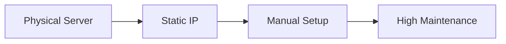

**Challenges:**
- 💰 **Expensive** hardware procurement
- 🔧 **Manual** environment setup
- 📊 **Poor** scalability
- 🚫 **Vendor lock-in**

### ☁️ Cloud Revolution (AWS Era)
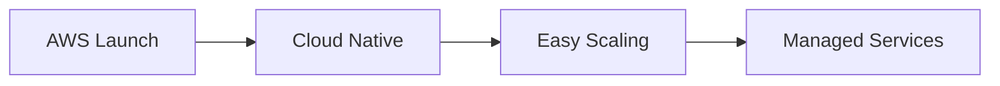

**Benefits:**
- ⚡ **Quick** resource provisioning
- 🔄 **Auto-scaling** capabilities
- 🛠️ **Managed services** (RDS, ELB, etc.)
- 💳 **Pay-as-you-use** model

### 📦 Containerization Revolution
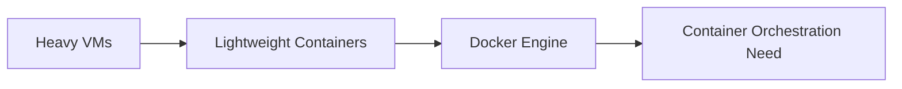

**Evolution:**
- 🏋️ **Heavy VMs** → 🪶 **Lightweight containers**
- 🚢 **Docker** made containerization accessible
- 🎯 **Need** for container orchestration emerged

### 🎯 Google's Solution: Borg → Kubernetes
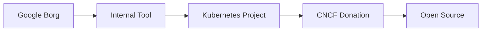

**Timeline:**
- 🏢 **Google** created **Borg** for internal use
- 🔄 **2014**: Kubernetes project started (ground-up rewrite)
- 🎁 **2014**: Donated to **CNCF** (Cloud Native Computing Foundation)[2]

## 🏗️ Kubernetes Architecture

Kubernetes follows a **master-worker** architecture with two main components:[2]

### 🎯 High-Level Architecture

```mermaid
graph TB
    subgraph "Control Plane"
        API[🎛️ API Server]
        ETCD[🗄️ etcd]
        SCHED[📅 Scheduler]
        CTRL[🎮 Controller Manager]
        CCM[☁️ Cloud Controller Manager]
    end
    
    subgraph "Worker Node 1"
        KUBELET1[🤖 Kubelet]
        PROXY1[🌐 Kube-proxy]
        CRI1[📦 Container Runtime]
        POD1[🐳 Pods]
    end
    
    subgraph "Worker Node 2"
        KUBELET2[🤖 Kubelet]
        PROXY2[🌐 Kube-proxy]
        CRI2[📦 Container Runtime]
        POD2[🐳 Pods]
    end
    
    API  KUBELET1
    API  KUBELET2
    API  ETCD
    API  SCHED
    API  CTRL
    API  CCM
```

## 🎛️ Control Plane Components

The **Control Plane** manages the overall state of the cluster. It consists of:[2][3]

### 🎯 API Server
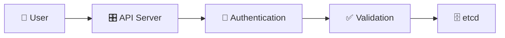

**Functions:**
- 🚪 **Entry point** for all administrative tasks
- 🔐 **Authentication** and **authorization**
- ✅ **Validates** API requests
- 📡 **Communication hub** between components[3]

### 🗄️ etcd
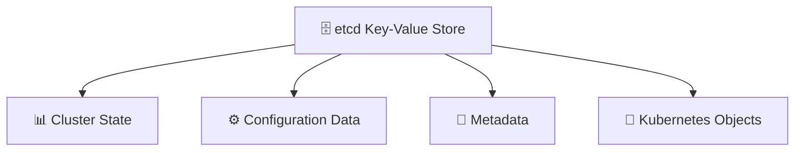

**Purpose:**
- 🗄️ **Distributed key-value store**
- 📊 Stores all **cluster state** information
- ⚙️ Contains **configuration data**
- 🔒 **Only accessible** via API Server[3]

### 📅 Scheduler
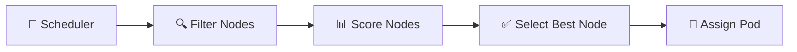

**Responsibilities:**
- 📍 **Assigns pods** to appropriate worker nodes
- 🔍 **Evaluates** resource requirements
- ⚖️ **Load balancing** across nodes
- 📊 **Optimizes** resource utilization[2]

### 🎮 Controller Manager
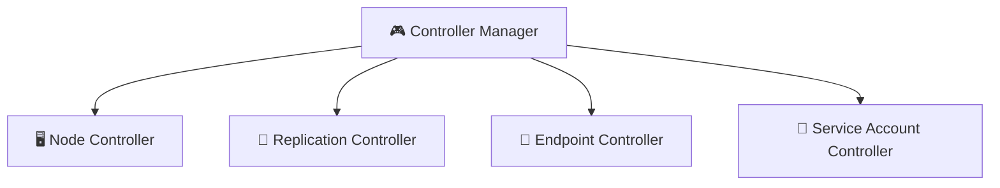

**Controllers Include:**
- 🖥️ **Node Controller**: Monitors node health
- 🔄 **Replication Controller**: Manages pod replicas
- 🔗 **Endpoint Controller**: Updates endpoint objects
- 🎯 **Service Account Controller**: Creates default service accounts[2]

### ☁️ Cloud Controller Manager (CCM)
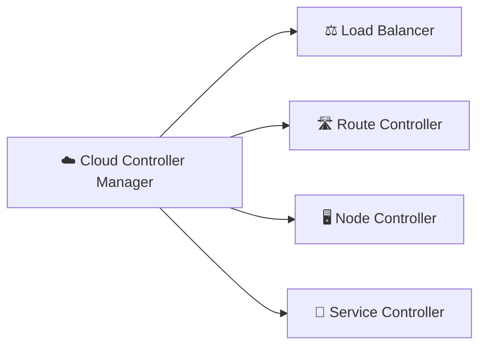

**Purpose:**
- ☁️ **Cloud-specific** control logic
- ⚖️ Manages **load balancers**
- 🛣️ Sets up **network routes**
- 🔌 **Links cluster** to cloud provider APIs[2]

## 👷 Worker Node Components

**Worker Nodes** run the actual containerized applications. Each node contains:[3]

### 🤖 Kubelet
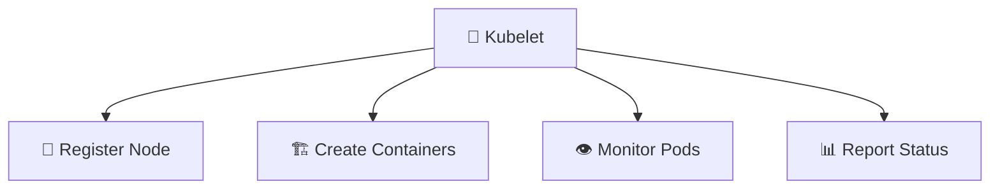

**Functions:**
- 📝 **Registers** worker node with API server
- 🏗️ **Creates/manages** containers for pods
- 👁️ **Monitors** pod health (liveness, readiness probes)
- 📊 **Reports** node and pod status[4]

### 🌐 Kube-proxy
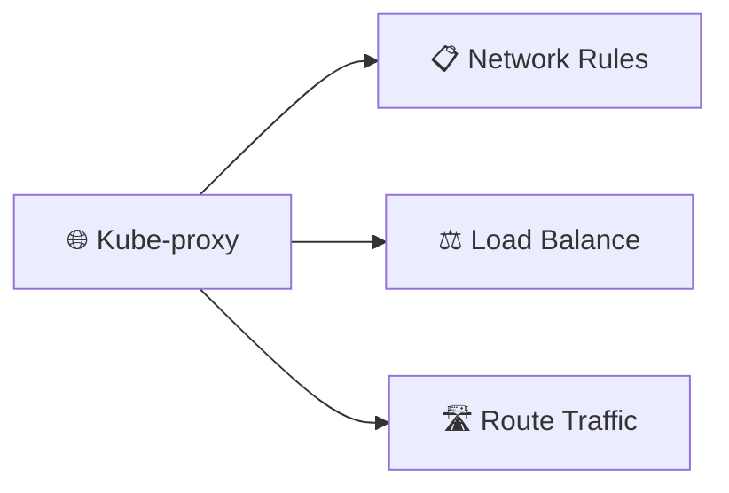

**Responsibilities:**
- 🌐 **Network proxy** on each node
- 📋 Maintains **network rules**
- ⚖️ **Load balances** traffic to pods
- 🛣️ **Routes** requests to appropriate pods[3]

### 📦 Container Runtime Interface (CRI)
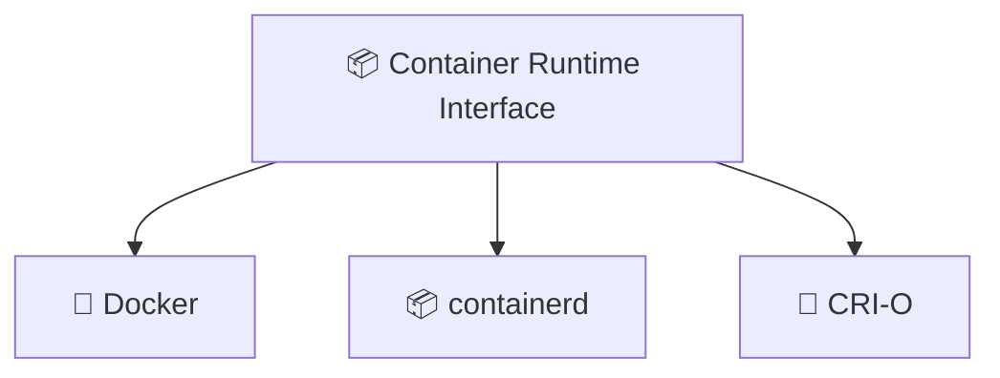

**Options:**
- 🐳 **Docker Engine**
- 📦 **containerd**
- 🔧 **CRI-O**
- 🚀 **Other OCI-compliant runtimes**[4]

### 🐳 Pods
```mermaid
graph TB
    POD[🐳 Pod] --> CONTAINER[📦 Container(s)]
    POD --> NETWORK[🌐 Shared Network]
    POD --> STORAGE[💾 Shared Storage]
    POD --> IP[🏷️ Pod IP]
```

**Characteristics:**
- 🐳 **Smallest deployable unit**
- 📦 Contains **one or more containers**
- 🌐 **Shared network** and storage
- 🏷️ Has **unique IP address**[3]

## 🔄 Kubernetes Workflow

### 📝 Deployment Process

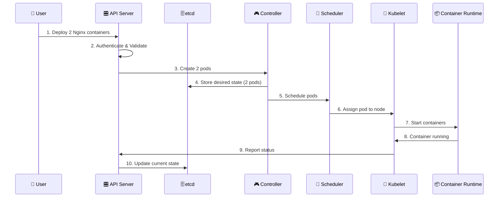

### 🔄 State Reconciliation

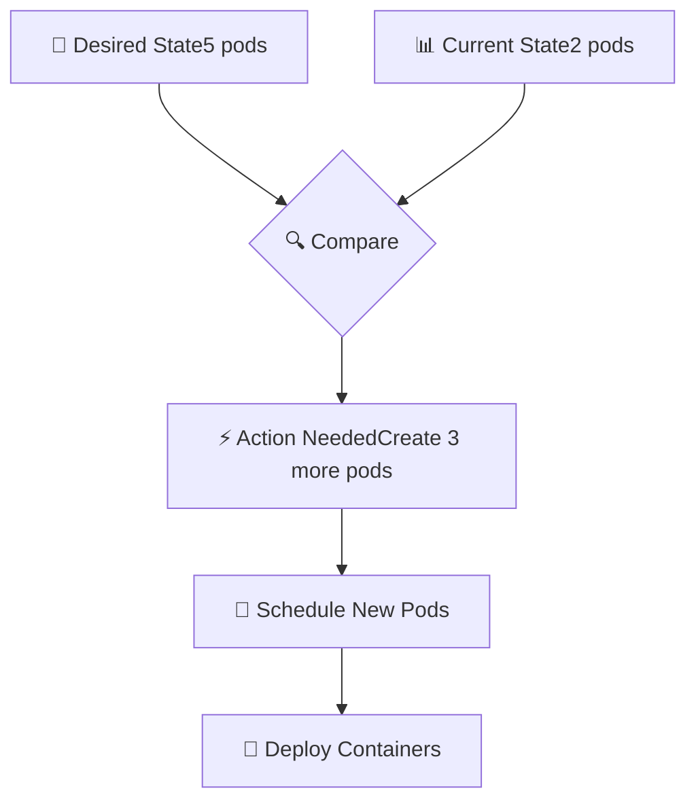

**Key Concept: Declarative Management**
- 🎯 You define **desired state**
- 🔍 Kubernetes **continuously monitors**
- ⚡ **Automatically reconciles** differences
- 🔄 **Self-healing** capabilities

## 📊 Architecture Diagrams

### 🏗️ Complete Kubernetes Architecture

```mermaid
graph TB
    subgraph "🎛️ Control Plane (Master Node)"
        API[🎛️ kube-apiserver• Authentication• API Gateway• Communication Hub]
        ETCD[🗄️ etcd• Key-Value Store• Cluster State• Configuration Data]
        SCHED[📅 kube-scheduler• Pod Scheduling• Resource Optimization• Node Selection]
        CTRL[🎮 kube-controller-manager• Node Controller• Replication Controller• Endpoint Controller]
        CCM[☁️ cloud-controller-manager• Load Balancer• Route Controller• Cloud Integration]
    end

    subgraph "👷 Worker Node 1"
        KUBELET1[🤖 kubelet• Pod Management• Node Registration• Health Monitoring]
        PROXY1[🌐 kube-proxy• Network Rules• Load Balancing• Traffic Routing]
        CRI1[📦 Container Runtime• Docker/containerd• Container Lifecycle• Image Management]
        
        subgraph "🐳 Pods"
            POD1A[📦 Pod 1nginx]
            POD1B[📦 Pod 2nginx]
        end
    end

    subgraph "👷 Worker Node 2"
        KUBELET2[🤖 kubelet• Pod Management• Node Registration• Health Monitoring]
        PROXY2[🌐 kube-proxy• Network Rules• Load Balancing• Traffic Routing]
        CRI2[📦 Container Runtime• Docker/containerd• Container Lifecycle• Image Management]
        
        subgraph "🐳 Pods"
            POD2A[📦 Pod 3nginx]
        end
    end

    API  ETCD
    API  SCHED
    API  CTRL
    API  CCM
    API  KUBELET1
    API  KUBELET2
    KUBELET1  CRI1
    KUBELET2  CRI2
    CRI1 --> POD1A
    CRI1 --> POD1B
    CRI2 --> POD2A
```

### 🔄 Pod Lifecycle Flow

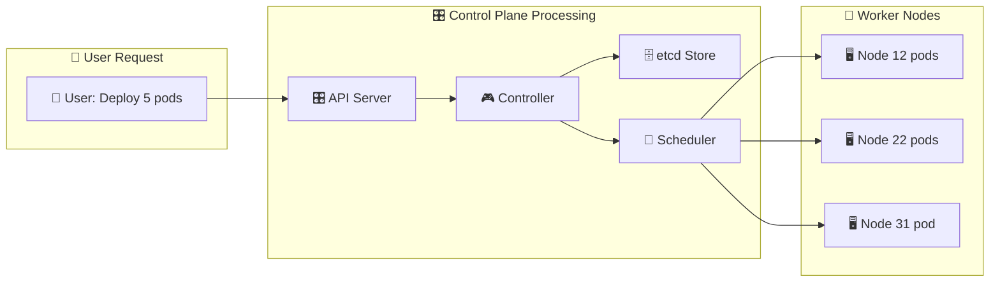

### 🌐 Networking Architecture

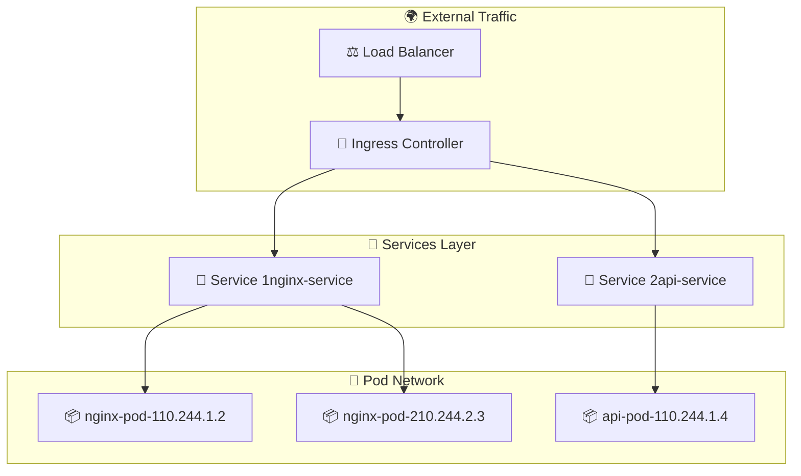

## 💡 Key Benefits

### 🚀 Why Choose Kubernetes?

| Feature | 📋 Description | 🎯 Benefit |
|---------|---------------|------------|
| **🌐 Cloud Agnostic** | Works on any infrastructure | 🔓 **No vendor lock-in** |
| **📈 Auto-scaling** | Scales based on demand | 💰 **Cost optimization** |
| **🔄 Self-healing** | Automatically replaces failed containers | 🛡️ **High availability** |
| **⚖️ Load Balancing** | Distributes traffic efficiently | 🚀 **Better performance** |
| **🔐 Security** | Built-in security features | 🛡️ **Enterprise-ready** |
| **📦 Rolling Updates** | Zero-downtime deployments | 🔄 **Continuous delivery** |

### 🎯 Use Cases

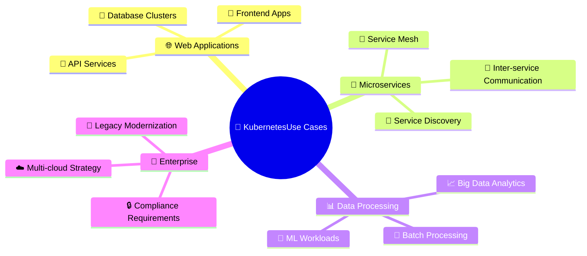

### 🛠️ Ecosystem Integration

```mermaid
graph TB
    K8S[🎯 Kubernetes Core]
    
    subgraph "📦 Container Tools"
        DOCKER[🐳 Docker]
        CONTAINERD[📦 containerd]
        PODMAN[🔧 Podman]
    end
    
    subgraph "🌐 Networking"
        CALICO[🕸️ Calico]
        FLANNEL[🌐 Flannel]
        WEAVE[🔗 Weave Net]
    end
    
    subgraph "💾 Storage"
        CEPH[💾 Ceph]
        NFS[📁 NFS]
        CLOUD[☁️ Cloud Storage]
    end
    
    subgraph "👁️ Monitoring"
        PROMETHEUS[📊 Prometheus]
        GRAFANA[📈 Grafana]
        JAEGER[🔍 Jaeger]
    end
    
    K8S --> DOCKER
    K8S --> CONTAINERD
    K8S --> PODMAN
    K8S --> CALICO
    K8S --> FLANNEL
    K8S --> WEAVE
    K8S --> CEPH
    K8S --> NFS
    K8S --> CLOUD
    K8S --> PROMETHEUS
    K8S --> GRAFANA
    K8S --> JAEGER
```

## 🎓 Summary

Kubernetes has revolutionized container orchestration by providing:

### 🔑 Key Takeaways
- 🎛️ **Centralized control** through the Control Plane
- 👷 **Distributed execution** via Worker Nodes
- 🔄 **Declarative management** with desired state reconciliation
- ☁️ **Cloud-agnostic** architecture preventing vendor lock-in
- 📈 **Enterprise-grade** features for production workloads

### 🚀 Getting Started
1. **📚 Learn** container fundamentals (Docker)
2. **🏗️ Understand** Kubernetes architecture
3. **🛠️ Practice** with local clusters (minikube, kind)
4. **☁️ Deploy** to cloud providers (EKS, GKE, AKS)
5. **🔧 Master** kubectl and YAML manifests

Kubernetes continues to be the **de facto standard** for container orchestration, enabling organizations to build scalable, resilient, and portable applications in the cloud-native era.[2][3]

[1] https://ppl-ai-file-upload.s3.amazonaws.com/web/direct-files/attachments/62888276/18255543-3118-4d7e-a119-a31107f18490/paste.txt
[2] https://kubernetes.io/docs/concepts/architecture/
[3] https://www.simform.com/blog/kubernetes-architecture/
[4] https://devopscube.com/kubernetes-architecture-explained/
[5] https://app.eraser.io/workspace/2GyNfNQs6bEl7WFlNzel
[6] https://app.eraser.io/workspace/2G
[7] https://k21academy.com/docker-kubernetes/kubernetes-architecture-components-overview-for-beginners/
[8] https://creately.com/guides/kubernetes-architecture-diagram/
[9] https://spot.io/resources/kubernetes-architecture/11-core-components-explained/
[10] https://dev.to/vaibhav_ca0da2b8bef9b07c2/kubernetes-architecture-workernode-2ohk
[11] https://www.clickittech.com/devops/kubernetes-architecture-diagram/
[12] https://www.armosec.io/glossary/kubernetes-control-plane/
[13] https://layer5.io/resources/kubernetes/kubernetes-architecture-101
[14] https://cloudairy.com/blog/understanding-kubernetes-architecture-diagrams-and-components/
[15] https://cloud.google.com/kubernetes-engine/docs/concepts/cluster-architecture
[16] https://cloudairy.com/template/kubernetes-architecture-diagram/
[17] https://kubernetes.io/docs/contribute/style/diagram-guide/
[18] https://spacelift.io/blog/kubernetes-architecture
[19] https://kubernetes.io/docs/concepts/architecture/nodes/
[20] https://www.eraser.io/ai/kubernetes-diagram-generator
[21] https://dev.to/monarene/inside-the-kubernetes-control-plane-28ie
[22] https://geekflare.com/devops/kubernetes-architecture/
[23] https://kubernetes.io/docs/concepts/overview/components/