```mermaid
flowchart TD
    U[👤 User] -->|node-ip:30001| N1[Node 1:30001]
    U -->|node-ip:30001| N2[Node 2:30001] 
    U -->|node-ip:30001| N3[Node 3:30001]
    
    N1 --> S[NodePort Service :80]
    N2 --> S
    N3 --> S
    
    S --> P1[Pod 1:8080]
    S --> P2[Pod 2:8080]
    S --> P3[Pod 3:8080]
    
    style U fill:#e3f2fd
    style N1 fill:#f3e5f5
    style N2 fill:#f3e5f5
    style N3 fill:#f3e5f5
    style S fill:#f1f8e9
```

```mermaid
flowchart TD
    I[🌐 Internet] --> CLB[☁️ Cloud Load Balancer]
    CLB --> N1[Node 1]
    CLB --> N2[Node 2]
    CLB --> N3[Node 3]
    
    N1 --> S[LoadBalancer Service]
    N2 --> S
    N3 --> S
    
    S --> P1[Pod 1]
    S --> P2[Pod 2]
    S --> P3[Pod 3]
    
    style I fill:#e3f2fd
    style CLB fill:#e8f5e8
    style S fill:#f1f8e9
```

# ✨ Kubernetes Services Deep Dive (CKA 2024) ✨

## 🎯 **What Are Kubernetes Services?**

Kubernetes Services are an **abstraction layer** that provides a stable network endpoint for accessing pods. They solve the fundamental problem of pod networking in dynamic environments where pods are constantly created, destroyed, and rescheduled.

## 1️⃣ **ClusterIP Service - Internal Cluster Communication** 🔒

### **🎯 Purpose & Use Cases:**
- **Default service type** (when no type is specified)
- Provides **internal-only** communication within the cluster
- Perfect for **backend services**, **databases**, **APIs** that don't need external access
- Enables **service discovery** through DNS names

### **🔧 How It Works:**


### **📝 Complete YAML Example:**
```yaml
apiVersion: v1
kind: Service
metadata:
  name: backend-service
  labels:
    app: backend
    tier: api
spec:
  type: ClusterIP  # Optional - this is default
  ports:
    - name: http           # Optional port name
      port: 80             # Port exposed by service
      targetPort: 8080     # Port on pod where app listens
      protocol: TCP        # Default is TCP
  selector:
    app: backend           # Matches pods with this label
    version: v1
```

### **🚀 Creating & Testing:**
```bash
# Create the service
kubectl apply -f clusterip.yaml

# Verify service creation
kubectl get svc backend-service
kubectl describe svc backend-service

# Check endpoints (pod IPs behind the service)
kubectl get endpoints backend-service

# Test from another pod
kubectl run test-pod --image=busybox --rm -it -- sh
# Inside the pod:
wget -qO- http://backend-service:80
# Or use full DNS name:
wget -qO- http://backend-service.default.svc.cluster.local:80
```

### **🔍 Key Features:**
- **Virtual IP (VIP)**: Service gets a stable cluster IP
- **DNS Resolution**: Service accessible via `..svc.cluster.local`
- **Load Balancing**: Distributes traffic across healthy pods
- **Health Checks**: Only routes to ready pods

### **💡 Best Practices:**
- Use meaningful service names (becomes DNS name)
- Always use labels for pod selection
- Consider port naming for multi-port services
- Use different ports for different protocols (HTTP, gRPC, etc.)

## 2️⃣ **NodePort Service - External Access Through Node Ports** 🌐

### **🎯 Purpose & Use Cases:**
- Provides **external access** to cluster services
- Exposes service on a **static port** on each node
- Good for **development**, **testing**, or **small deployments**
- **Not recommended** for production (security concerns, port management)

### **🔧 How It Works:**


### **📝 Complete YAML Example:**
```yaml
apiVersion: v1
kind: Service
metadata:
  name: frontend-nodeport
  labels:
    app: frontend
    service-type: nodeport
spec:
  type: NodePort
  ports:
    - name: http
      port: 80              # ClusterIP port (internal)
      targetPort: 8080      # Pod port
      nodePort: 30001       # External port (30000-32767)
      protocol: TCP
  selector:
    app: frontend
    tier: web
```

### **🚀 Creating & Testing:**
```bash
# Create NodePort service
kubectl apply -f nodeport.yaml

# Check service details
kubectl get svc frontend-nodeport
kubectl describe svc frontend-nodeport

# Get node IPs
kubectl get nodes -o wide

# Access externally (replace with actual node IP)
curl http://:30001
curl http://172.18.0.2:30001

# For kind clusters (after port mapping):
curl http://localhost:30001
```

### **🔍 Port Types Explained:**
- **NodePort (30001)**: External port accessible from outside cluster
- **Port (80)**: Internal cluster port for pod-to-pod communication
- **TargetPort (8080)**: Actual port where application listens in pod

### **⚙️ NodePort Range & Allocation:**
- **Default range**: 30000-32767
- **Random allocation**: If nodePort not specified, Kubernetes assigns randomly
- **Manual specification**: Can specify specific port within range
- **Firewall considerations**: Ensure NodePort range is open in firewalls

### **🔐 Security Considerations:**
- Exposes services on all nodes
- Requires firewall rules for NodePort range
- No built-in SSL termination
- Consider using ingress controllers instead for production

## 3️⃣ **LoadBalancer Service - Cloud Provider Integration** ☁️

### **🎯 Purpose & Use Cases:**
- **Production-grade** external access
- Integrates with **cloud provider load balancers** (AWS ALB/NLB, Azure LB, GCP LB)
- Provides **high availability** and **SSL termination**
- Handles **traffic distribution** and **health checks**

### **🔧 How It Works:**


### **📝 Complete YAML Example:**
```yaml
apiVersion: v1
kind: Service
metadata:
  name: web-loadbalancer
  labels:
    app: web
    service-type: loadbalancer
  annotations:
    # AWS specific annotations
    service.beta.kubernetes.io/aws-load-balancer-type: "nlb"
    service.beta.kubernetes.io/aws-load-balancer-ssl-cert: "arn:aws:acm:region:account:certificate/cert-id"
    # Azure specific annotations
    service.beta.kubernetes.io/azure-load-balancer-internal: "false"
spec:
  type: LoadBalancer
  ports:
    - name: http
      port: 80
      targetPort: 8080
      protocol: TCP
    - name: https
      port: 443
      targetPort: 8080
      protocol: TCP
  selector:
    app: web
    tier: frontend
  # Optional: Restrict source IPs
  loadBalancerSourceRanges:
    - "10.0.0.0/8"
    - "192.168.0.0/16"
```

### **🚀 Creating & Testing:**
```bash
# Create LoadBalancer service
kubectl apply -f loadbalancer.yaml

# Check service status (wait for EXTERNAL-IP)
kubectl get svc web-loadbalancer -w

# Check cloud provider load balancer details
kubectl describe svc web-loadbalancer

# Access via external IP (once provisioned)
curl http://
curl https://
```

### **☁️ Cloud Provider Specifics:**

#### **AWS Integration:**
- Creates Application Load Balancer (ALB) or Network Load Balancer (NLB)
- Supports SSL certificates from ACM
- Integrates with Route 53 for DNS
- Security groups automatically configured

#### **Azure Integration:**
- Creates Azure Load Balancer
- Supports internal and external load balancers
- Integrates with Azure DNS
- Network security groups configured

#### **GCP Integration:**
- Creates Google Cloud Load Balancer
- Supports HTTP(S) and TCP load balancing
- Integrates with Cloud DNS
- Firewall rules automatically created

### **⏱️ Behavior in Different Environments:**
- **Cloud platforms**: Provisions actual external load balancer
- **Local clusters** (kind, minikube): Shows `` status, falls back to NodePort
- **On-premises**: Requires MetalLB or similar load balancer implementation

## 4️⃣ **ExternalName Service - DNS Aliasing & Service Mesh** 🔗

### **🎯 Purpose & Use Cases:**
- **DNS aliasing** for external services
- **Service mesh integration** patterns
- **Migration scenarios** (gradual move from external to internal services)
- **Multi-cluster** service discovery
- **Legacy system** integration

### **🔧 How It Works:**


```mermaid
flowchart LR
    P[Pod] -->|"external-db.default.svc.cluster.local"| S[ExternalName Service]
    S -->|DNS CNAME| E[📍 external-database.company.com:5432]
    
    style P fill:#e3f2fd
    style S fill:#fff3e0
    style E fill:#f3e5f5
```

### **📝 Complete YAML Examples:**

#### **Database Connection Example:**
```yaml
apiVersion: v1
kind: Service
metadata:
  name: external-database
  labels:
    app: database
    type: external
spec:
  type: ExternalName
  externalName: prod-db.company.com  # External FQDN
  ports:
    - name: postgres
      port: 5432
      protocol: TCP
```

#### **API Gateway Example:**
```yaml
apiVersion: v1
kind: Service
metadata:
  name: payment-api
  labels:
    app: payment
    type: external
spec:
  type: ExternalName
  externalName: api.payment-provider.com
  ports:
    - name: https
      port: 443
      protocol: TCP
```

### **🚀 Creating & Testing:**
```bash
# Create ExternalName service
kubectl apply -f externalname.yaml

# Verify service creation
kubectl get svc external-database
kubectl describe svc external-database

# Test DNS resolution from pod
kubectl run test-pod --image=busybox --rm -it -- sh
# Inside pod:
nslookup external-database.default.svc.cluster.local
# Should resolve to external-database.company.com

# Test connection (if external service is accessible)
telnet external-database.default.svc.cluster.local 5432
```

### **🔍 Advanced Use Cases:**

#### **Migration Pattern:**
```yaml
# Phase 1: Point to external service
apiVersion: v1
kind: Service
metadata:
  name: user-service
spec:
  type: ExternalName
  externalName: legacy-users.company.com

---
# Phase 2: Gradually move to internal service
apiVersion: v1
kind: Service
metadata:
  name: user-service
spec:
  type: ClusterIP
  ports:
    - port: 80
      targetPort: 8080
  selector:
    app: user-service-v2
```

#### **Multi-Environment Configuration:**
```yaml
# Development environment
apiVersion: v1
kind: Service
metadata:
  name: payment-service
spec:
  type: ExternalName
  externalName: payment-dev.company.com

---
# Production environment  
apiVersion: v1
kind: Service
metadata:
  name: payment-service
spec:
  type: ExternalName
  externalName: payment-prod.company.com
```

### **🔧 DNS Behavior:**
- **CNAME record**: ExternalName creates DNS CNAME pointing to external FQDN
- **No proxy**: Traffic goes directly from pod to external service
- **No load balancing**: Kubernetes doesn't handle external service load balancing
- **No health checks**: External service health not monitored by Kubernetes

### **⚠️ Limitations:**
- No built-in load balancing for external services
- No health checking of external endpoints
- Requires external service to be accessible from cluster
- DNS-only solution (no IP-based routing)

## 🎛️ **Service Creation Methods Comparison**

### **📝 Declarative (YAML) - Recommended for Production:**
```bash
# Create from YAML file
kubectl apply -f service.yaml

# Update service
kubectl apply -f service.yaml

# Benefits: Version control, repeatability, complex configurations
```

### **⚡ Imperative (CLI) - Quick Testing & Exam:**
```bash
# Expose deployment as ClusterIP
kubectl expose deployment app --port=80 --target-port=8080

# Expose as NodePort
kubectl expose deployment app --type=NodePort --port=80

# Expose as LoadBalancer
kubectl expose deployment app --type=LoadBalancer --port=80

# Generate YAML from imperative command
kubectl expose deployment app --port=80 --dry-run=client -o yaml > service.yaml
```

## 🔧 **Advanced Service Features**

### **🎯 Multi-Port Services:**
```yaml
apiVersion: v1
kind: Service
metadata:
  name: multi-port-service
spec:
  type: ClusterIP
  ports:
    - name: http
      port: 80
      targetPort: 8080
    - name: https  
      port: 443
      targetPort: 8443
    - name: metrics
      port: 9090
      targetPort: 9090
  selector:
    app: web-server
```

### **🔒 Session Affinity:**
```yaml
apiVersion: v1
kind: Service
metadata:
  name: sticky-service
spec:
  type: ClusterIP
  sessionAffinity: ClientIP  # Routes same client to same pod
  sessionAffinityConfig:
    clientIP:
      timeoutSeconds: 3600   # Session timeout
  ports:
    - port: 80
      targetPort: 8080
  selector:
    app: stateful-app
```

### **🌐 Headless Services (No ClusterIP):**
```yaml
apiVersion: v1
kind: Service
metadata:
  name: headless-service
spec:
  clusterIP: None  # No cluster IP assigned
  ports:
    - port: 80
      targetPort: 8080
  selector:
    app: database
# Use case: StatefulSets, direct pod access via DNS
```

## 🛠️ **Troubleshooting Services**

### **🔍 Common Debugging Commands:**
```bash
# Check service status
kubectl get svc
kubectl describe svc 

# Check endpoints
kubectl get endpoints 
kubectl describe endpoints 

# Check pod labels match service selector
kubectl get pods --show-labels
kubectl get pods -l app=frontend

# Test service connectivity
kubectl run debug --image=busybox --rm -it -- sh
# Inside pod: wget -qO- http://service-name:port

# Port forward for local testing
kubectl port-forward svc/my-service 8080:80
```

### **🚨 Common Issues & Solutions:**

| Issue | Symptoms | Solution |
|-------|----------|----------|
| **No endpoints** | Service exists but no pods behind it | Check pod labels match service selector |
| **Connection refused** | Can't connect to service | Verify targetPort matches pod's listening port |
| **External IP pending** | LoadBalancer shows `` | Check cloud provider integration/credentials |
| **NodePort not accessible** | Can't reach via node IP:port | Check firewall rules, security groups |
| **DNS not resolving** | Service name doesn't resolve | Check CoreDNS pods, namespace spelling |

## 📊 **Service Types Comparison Table**

| Feature | ClusterIP | NodePort | LoadBalancer | ExternalName |
|---------|-----------|----------|--------------|--------------|
| **External Access** | ❌ | ✅ | ✅ | ✅ |
| **Load Balancing** | ✅ | ✅ | ✅ | ❌ |
| **Cloud Integration** | ❌ | ❌ | ✅ | ❌ |
| **Port Range** | Any | 30000-32767 | Any | Any |
| **Production Ready** | ✅ | ⚠️ | ✅ | ✅ |
| **SSL Termination** | ❌ | ❌ | ✅ (cloud) | ❌ |
| **Cost** | Free | Free | Cloud charges | Free |
| **Use Case** | Internal APIs | Dev/Test | Production web apps | External services |

## 🎯 **Best Practices Summary**

### **🏗️ Architecture:**
- Use **ClusterIP** for internal service communication
- Use **LoadBalancer** for production external access
- Avoid **NodePort** in production (use Ingress instead)
- Use **ExternalName** for external service integration

### **🔧 Configuration:**
- Always use meaningful service and port names
- Match service selectors with pod labels carefully
- Use health checks and readiness probes
- Consider session affinity for stateful applications

### **🔒 Security:**
- Restrict LoadBalancer source ranges when needed
- Use network policies to control service access
- Implement proper authentication/authorization
- Regular security scanning of exposed services

### **📈 Monitoring:**
- Monitor service endpoints health
- Track service response times and errors
- Alert on service discovery issues
- Monitor cloud load balancer costs and usage

## 🎯 **Exam Tips**

✅ **Know the port types**: NodePort vs Port vs TargetPort  
✅ **Service selector**: Must match pod labels exactly  
✅ **Default behavior**: ClusterIP is default service type  
✅ **Imperative commands**: `kubectl expose` for quick service creation  
✅ **Troubleshooting**: Use `kubectl get endpoints` to verify pod selection  
✅ **DNS names**: `service-name.namespace.svc.cluster.local`  

**🚀 Practice all service types in your lab environment!**