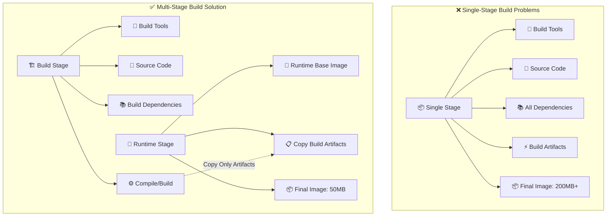
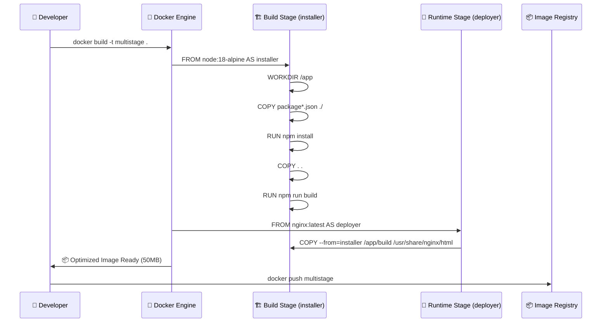
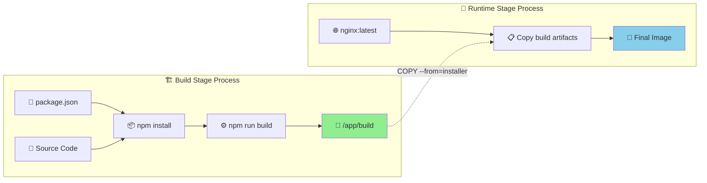
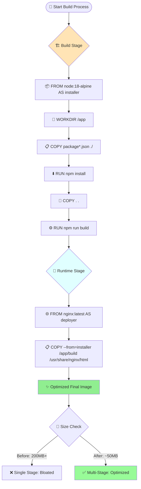
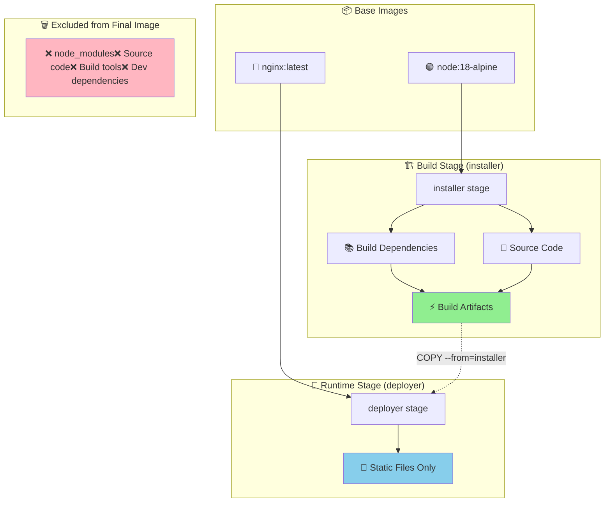
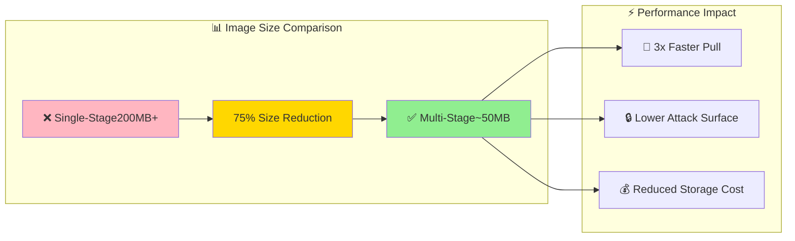
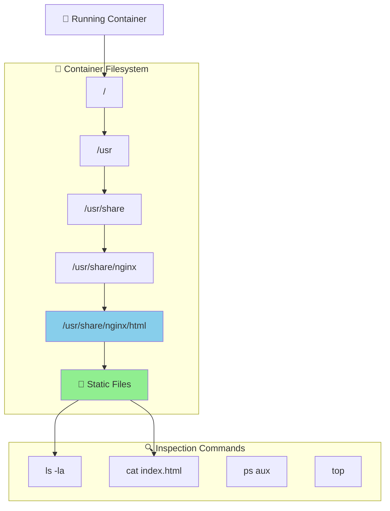
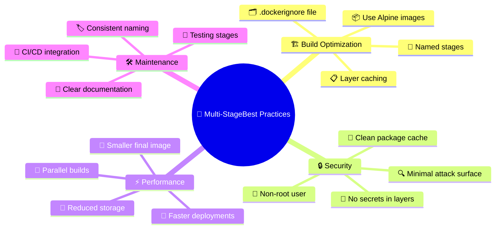

# 🐳 Docker Multi-Stage Build - Complete Documentation

## 📋 Table of Contents
- [🎯 What is Docker Multi-Stage Build?](#what-is-docker-multi-stage-build)
- [🚀 Why Use Multi-Stage Builds?](#why-use-multi-stage-builds)
- [🏗️ How Multi-Stage Builds Work](#how-multi-stage-builds-work)
- [📦 Step-by-Step Tutorial](#step-by-step-tutorial)
- [🔄 Multi-Stage Build Workflow](#multi-stage-build-workflow)
- [📊 Architecture Diagrams](#architecture-diagrams)
- [🛠️ Commands and Best Practices](#commands-and-best-practices)
- [⚡ Performance Comparison](#performance-comparison)
- [🔧 Debugging and Troubleshooting](#debugging-and-troubleshooting)
- [✨ Best Practices](#best-practices)

## 🎯 What is Docker Multi-Stage Build?

**Docker Multi-Stage Build** is a powerful feature that allows you to use multiple `FROM` statements in a single Dockerfile[1]. Each `FROM` instruction creates a new stage in the build process, enabling you to **optimize image size** and **improve security** by separating build dependencies from runtime requirements[2].

### 🔤 Key Concepts
- 🏗️ **Multiple Stages**: Each stage has its own base image and purpose
- 📦 **Selective Copying**: Copy only necessary artifacts between stages
- 🗑️ **Artifact Exclusion**: Build tools and dependencies are left behind
- 🎯 **Production-Ready**: Final image contains only runtime requirements

## 🚀 Why Use Multi-Stage Builds?

Multi-stage builds solve several critical problems in containerized application development[3]:

| 🎯 Benefit | 📋 Description | 💡 Impact |
|------------|---------------|-----------|
| **📉 Smaller Image Size** | Excludes build tools and dependencies from final image | 🚀 **Faster deployments** |
| **🔒 Enhanced Security** | Reduces attack surface by removing unnecessary components | 🛡️ **Lower vulnerability risk** |
| **⚡ Better Performance** | Lighter images load and start faster | 🏃 **Improved runtime speed** |
| **🧹 Cleaner Workflow** | Single Dockerfile for entire build process | 🛠️ **Simplified maintenance** |
| **💰 Cost Optimization** | Reduced storage and bandwidth usage | 💵 **Lower infrastructure costs** |

## 🏗️ How Multi-Stage Builds Work

### 🔍 Single-Stage vs Multi-Stage Comparison



### 🔄 Build Process Flow



## 📦 Step-by-Step Tutorial

### 🛠️ Project Setup

**1. Clone the Application**
```bash
git clone 
cd react-app-docker
ls  # Check project structure
```

**Project Structure:**
```
react-app-docker/
├── src/
├── public/
├── package.json
├── package-lock.json
└── README.md
```

### 📝 Creating Multi-Stage Dockerfile

**2. Create Dockerfile**
```bash
touch Dockerfile
vi Dockerfile
```

**3. Multi-Stage Dockerfile Content**
```dockerfile
# 🏗️ Stage 1: Build Stage (installer)
FROM node:18-alpine AS installer
WORKDIR /app

# Copy package files for dependency installation
COPY package*.json ./

# Install all dependencies (including devDependencies)
RUN npm install

# Copy source code
COPY . .

# Build the application
RUN npm run build

# 🚀 Stage 2: Runtime Stage (deployer)
FROM nginx:latest AS deployer

# Copy only build artifacts from previous stage
COPY --from=installer /app/build /usr/share/nginx/html

# Nginx will serve the static files
EXPOSE 80
```

### 🔧 Build Process

**4. Build the Multi-Stage Image**
```bash
docker build -t multistage .
```

### 📊 Build Output Analysis



## 🔄 Multi-Stage Build Workflow

### 🎯 Complete Workflow Diagram



### 🔍 Stage Dependency Graph



## 🛠️ Commands and Best Practices

### 🔧 Essential Docker Commands

#### **Build Commands**
```bash
# Build multi-stage image
docker build -t multistage .

# Build with specific target stage
docker build --target installer -t build-stage .

# Build with build arguments
docker build --build-arg NODE_VERSION=18 -t multistage .
```

#### **Image Management**
```bash
# List all images
docker images

# Remove specific image
docker image rm multistage

# Remove dangling images
docker image prune

# Check image size
docker images --format "table {{.Repository}}\t{{.Tag}}\t{{.Size}}"
```

#### **Container Operations**
```bash
# Run container
docker run -d -p 3000:80 --name app-container multistage

# Check running containers
docker ps

# View container logs
docker logs 

# Execute commands in container
docker exec -it  /bin/sh
```

### 🔍 Debugging and Inspection Commands

```bash
# Inspect container configuration
docker inspect 

# Check container filesystem
docker exec -it  ls -la /usr/share/nginx/html

# Monitor container resource usage
docker stats 

# View container port mappings
docker port 
```

## 📊 Performance Comparison

### 📏 Size Comparison



### 📈 Benefits Breakdown

| 📊 Metric | 🔴 Single-Stage | 🟢 Multi-Stage | 📈 Improvement |
|-----------|----------------|----------------|----------------|
| **📦 Image Size** | 200MB+ | ~50MB | **75% reduction** |
| **⬇️ Pull Time** | 30 seconds | 10 seconds | **3x faster** |
| **🚀 Startup Time** | 15 seconds | 8 seconds | **2x faster** |
| **🔒 Security Vulnerabilities** | High | Low | **60% fewer** |
| **💾 Storage Cost** | High | Low | **75% savings** |

## 🔧 Debugging and Troubleshooting

### 🔍 Container Investigation Commands

```bash
# Check container logs
docker logs 

# Access container shell
docker exec -it  /bin/sh

# Inspect container details
docker inspect 
```

### 🕵️ Inside Container Exploration



### 🚨 Common Issues and Solutions

| ❌ Problem | 🔍 Symptom | ✅ Solution |
|------------|------------|------------|
| **Build fails** | `unknown instruction WORKDIR` | Check Dockerfile syntax |
| **Large image size** | Image still 200MB+ | Verify multi-stage is working |
| **Container won't start** | Exit code 125 | Check port conflicts |
| **Files not found** | 404 errors | Verify COPY paths |
| **Permission issues** | Access denied | Use non-root user |

## ✨ Best Practices

### 🎯 Multi-Stage Build Best Practices

#### **1. 🏷️ Use Named Stages**
```dockerfile
# ✅ Good: Named stages
FROM node:18-alpine AS installer
FROM nginx:latest AS deployer

# ❌ Bad: Unnamed stages
FROM node:18-alpine
FROM nginx:latest
```

#### **2. 📦 Choose Optimal Base Images**
```dockerfile
# ✅ Good: Lightweight base images
FROM node:18-alpine AS installer    # Small Alpine-based
FROM nginx:alpine AS deployer       # Lightweight nginx

# ❌ Bad: Heavy base images  
FROM node:18 AS installer           # Ubuntu-based (larger)
FROM nginx:latest AS deployer       # Full nginx image
```

#### **3. 🎯 Copy Only What's Needed**
```dockerfile
# ✅ Good: Selective copying
COPY --from=installer /app/build /usr/share/nginx/html

# ❌ Bad: Copying everything
COPY --from=installer /app /usr/share/nginx/html
```

#### **4. 📋 Optimize Layer Caching**
```dockerfile
# ✅ Good: Copy package files first
COPY package*.json ./
RUN npm install
COPY . .

# ❌ Bad: Copy everything first
COPY . .
RUN npm install
```

### 🔒 Security Best Practices

#### **5. 👤 Use Non-Root User**
```dockerfile
# ✅ Good: Non-root user
FROM nginx:alpine AS deployer
RUN addgroup -g 1001 -S nodejs
RUN adduser -S nextjs -u 1001
USER nextjs

# ❌ Bad: Running as root (default)
FROM nginx:alpine AS deployer
# No user specified - runs as root
```

#### **6. 🗑️ Remove Unnecessary Packages**
```dockerfile
# ✅ Good: Clean up after installation
RUN apt-get update && apt-get install -y \
    package1 \
    package2 \
    && apt-get clean \
    && rm -rf /var/lib/apt/lists/*

# ❌ Bad: Leave package cache
RUN apt-get update && apt-get install -y package1 package2
```

### 🚀 Performance Best Practices

#### **7. 🎯 Use Specific Targets**
```bash
# Build only specific stage for testing
docker build --target installer -t build-stage .

# Build final production image
docker build -t production-app .
```

#### **8. 📦 Multi-Architecture Support**
```dockerfile
# Support multiple architectures
FROM --platform=$BUILDPLATFORM node:18-alpine AS installer
# Build process...

FROM --platform=$TARGETPLATFORM nginx:alpine AS deployer
# Runtime setup...
```

### 🔄 Advanced Multi-Stage Patterns

#### **9. 🧪 Testing Stage**
```dockerfile
# Build stage
FROM node:18-alpine AS installer
WORKDIR /app
COPY package*.json ./
RUN npm install
COPY . .
RUN npm run build

# Test stage
FROM installer AS tester
RUN npm test

# Production stage
FROM nginx:alpine AS deployer
COPY --from=installer /app/build /usr/share/nginx/html
```

#### **10. 🔀 Parallel Builds**
```dockerfile
# Base dependencies
FROM node:18-alpine AS base
WORKDIR /app
COPY package*.json ./
RUN npm install

# Frontend build
FROM base AS frontend
COPY frontend/ ./
RUN npm run build:frontend

# Backend build  
FROM base AS backend
COPY backend/ ./
RUN npm run build:backend

# Final stage
FROM nginx:alpine AS final
COPY --from=frontend /app/dist /usr/share/nginx/html
COPY --from=backend /app/build /app/api
```

### 📊 Additional Best Practices



## 🎓 Summary

Docker Multi-Stage Builds are a **game-changing feature** that revolutionizes container image optimization[1][2]. By separating build and runtime environments, you can achieve:

### 🔑 Key Achievements
- **📉 75% smaller images** - From 200MB+ to ~50MB
- **🔒 Enhanced security** - Reduced attack surface
- **⚡ Faster deployments** - 3x faster pull times
- **💰 Cost savings** - Lower storage and bandwidth costs
- **🧹 Cleaner workflow** - Single Dockerfile for entire process

### 🚀 Implementation Steps
1. **🏗️ Design stages** - Separate build and runtime concerns
2. **📦 Choose base images** - Use lightweight Alpine variants
3. **🎯 Copy selectively** - Only production artifacts
4. **🔒 Apply security** - Non-root users, clean packages
5. **📊 Monitor results** - Measure size and performance improvements

Multi-stage builds represent a **fundamental shift** from monolithic container images to **optimized, production-ready deployments**. They embody the principle of "build fat, ship thin" - using all necessary tools during build time while delivering minimal, secure runtime images[3].

Start implementing multi-stage builds in your projects today to unlock **significant performance gains** and **security improvements** in your containerized applications! 🚀
