# 🚀 Kubernetes Fundamentals - Complete Documentation

## 📋 Table of Contents
- [🎯 What is Kubernetes and Why Do We Need It?](#what-is-kubernetes-and-why-do-we-need-it)
- [🚨 Docker Container Challenges](#docker-container-challenges)
- [🔧 Manual Container Management Problems](#manual-container-management-problems)
- [🎛️ Kubernetes: The Solution](#kubernetes-the-solution)
- [📊 Container Orchestration Benefits](#container-orchestration-benefits)
- [⚖️ When NOT to Use Kubernetes](#when-not-to-use-kubernetes)
- [🔄 Decision Making Framework](#decision-making-framework)
- [📈 Architecture Overview](#architecture-overview)
- [🎓 Key Takeaways](#key-takeaways)

## 🎯 What is Kubernetes and Why Do We Need It?

**Kubernetes** is a container orchestration platform that automates the deployment, scaling, and management of containerized applications. It solves the critical challenges that arise when running containers in production environments.

### 🔍 The Evolution Problem

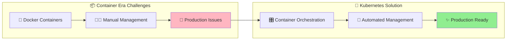

## 🚨 Docker Container Challenges

### 📱 Small Application Scenario

**Initial Setup:**
- 🏗️ Small application with 3-5 containers
- 🖥️ Running on a single virtual machine
- 👥 Small team managing the infrastructure
- 😊 Everything working fine initially

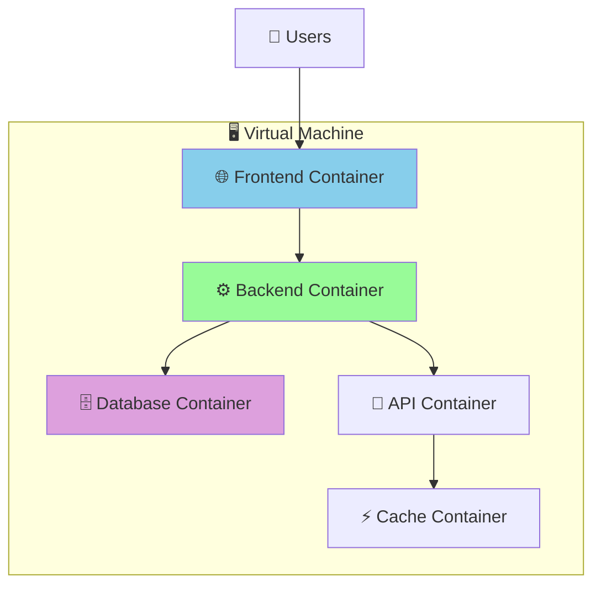

### 🚨 When Things Go Wrong

#### **1. Single Container Failure**
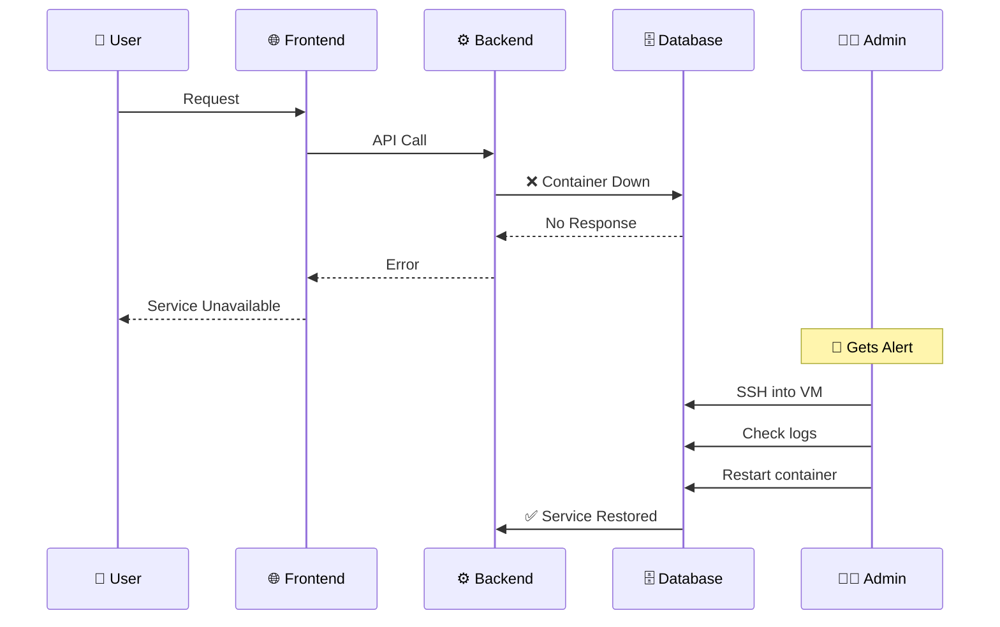

#### **2. Multiple Container Crashes**
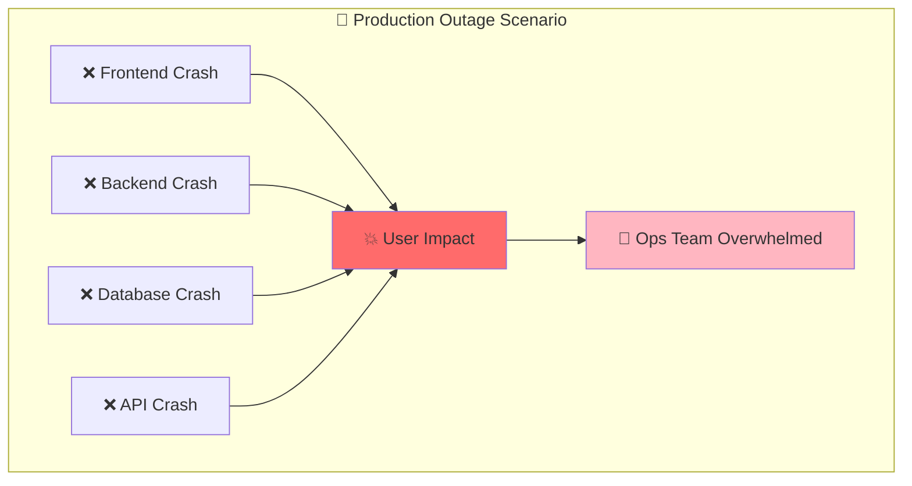

## 🔧 Manual Container Management Problems

### 🕐 24/7 Operations Challenge

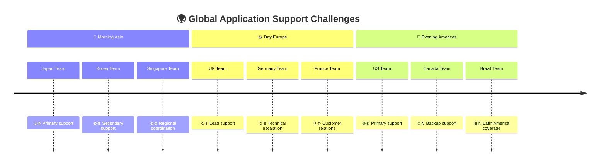

**Challenges:**
- 💰 **High Cost**: Need teams across multiple time zones
- 👥 **Resource Intensive**: Multiple skilled operators required
- ⏰ **Response Time**: Manual intervention delays
- 🎯 **Human Error**: Manual processes prone to mistakes

### 🏢 Enterprise Scale Problems

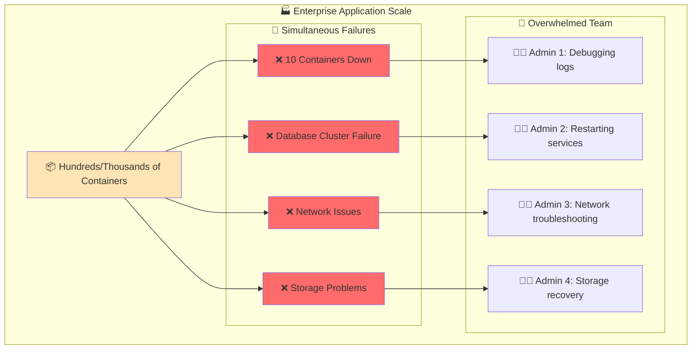

### 🚀 Deployment Challenges

#### **Version Upgrade Nightmare**
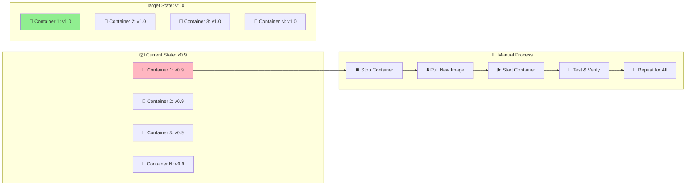

### 🌐 Infrastructure Management Issues

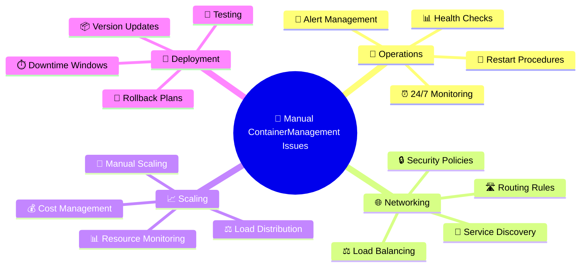

## 🎛️ Kubernetes: The Solution

### 🤖 Automated Container Orchestration

Kubernetes addresses all the manual management challenges through **intelligent automation**:

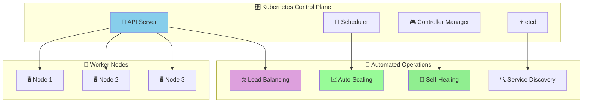

### 🔄 Self-Healing Capabilities

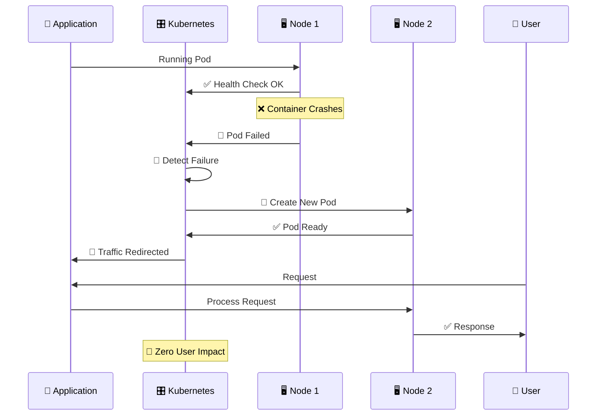

## 📊 Container Orchestration Benefits

### 🎯 Key Kubernetes Advantages

| 🏷️ Feature | 🔧 Manual Management | 🤖 Kubernetes | 💡 Benefit |
|-------------|---------------------|----------------|------------|
| **🚨 Failure Recovery** | Manual restart, downtime | Automatic self-healing | 🔄 **Zero-touch recovery** |
| **📈 Scaling** | Manual resource adjustment | Auto-scaling based on metrics | ⚡ **Dynamic resource optimization** |
| **🚀 Deployments** | Sequential manual updates | Rolling updates, blue-green | 🌊 **Zero-downtime deployments** |
| **⚖️ Load Balancing** | External LB configuration | Built-in service mesh | 🎯 **Intelligent traffic distribution** |
| **🔍 Service Discovery** | Manual DNS/config updates | Automatic service registration | 🗺️ **Dynamic service mapping** |
| **🔒 Security** | Manual policy management | RBAC, network policies | 🛡️ **Automated security enforcement** |

### 📈 Scalability Demonstration

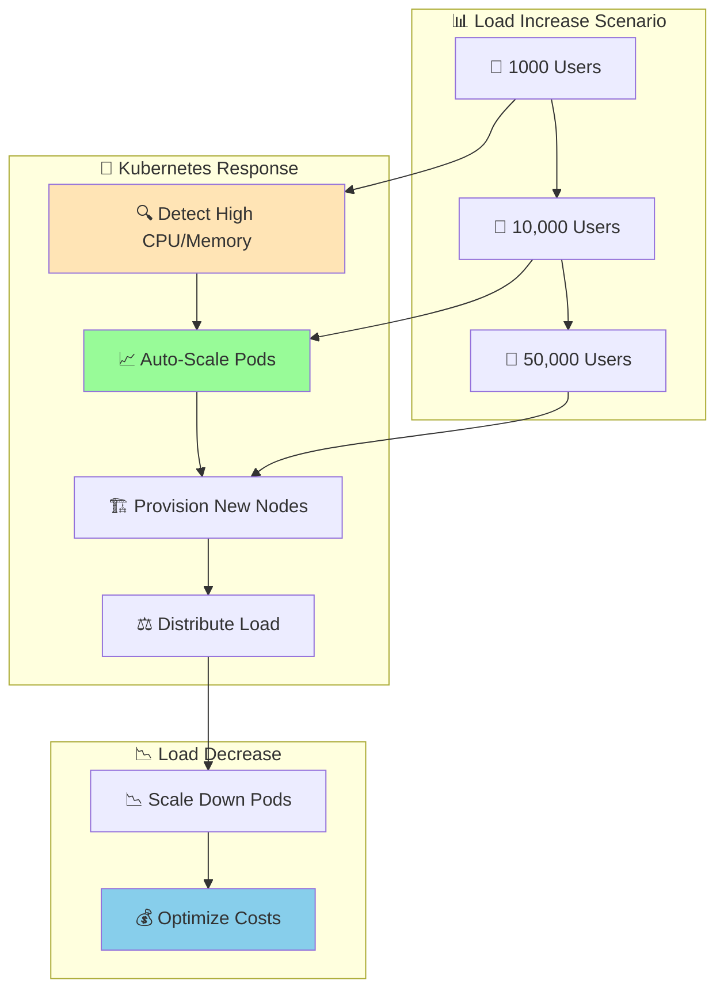

### 🌐 High Availability Architecture

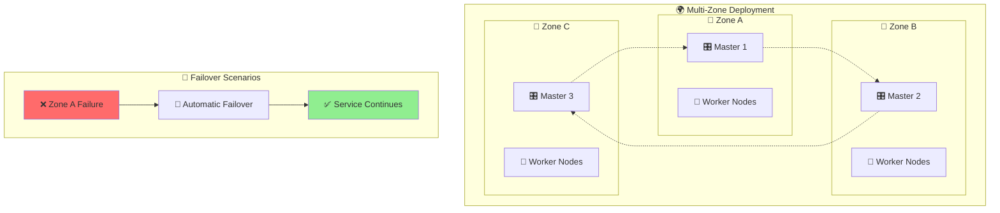

## ⚖️ When NOT to Use Kubernetes

### 🎯 Right-Sizing Your Solution

Kubernetes is **not always the answer**. Consider these scenarios where simpler solutions might be better:

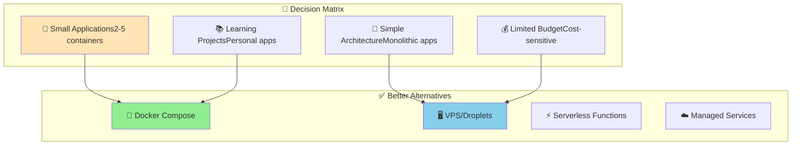

### 💰 Cost-Benefit Analysis

#### **Small Application Example: Todo App**

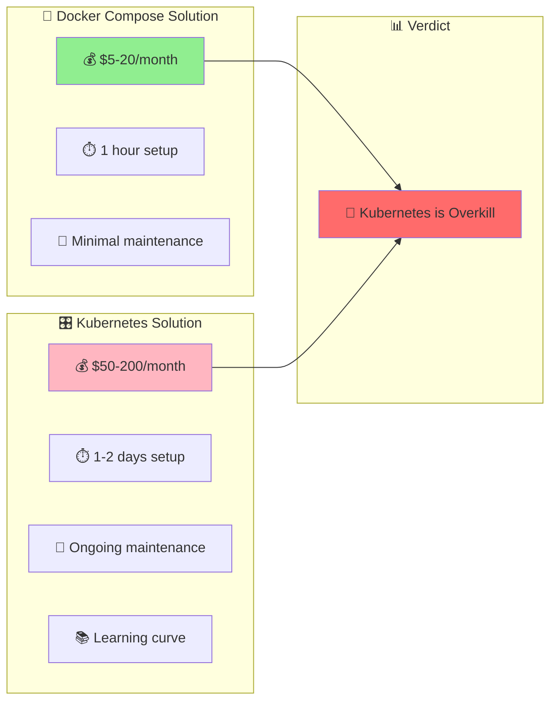

### 🎯 When Kubernetes Makes Sense

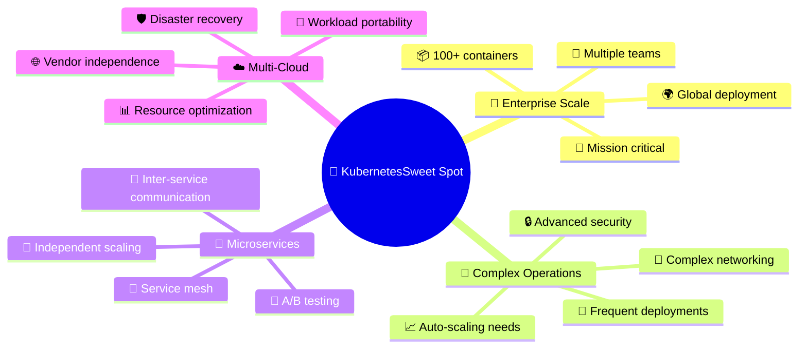

## 🔄 Decision Making Framework

### 📊 Kubernetes Readiness Assessment

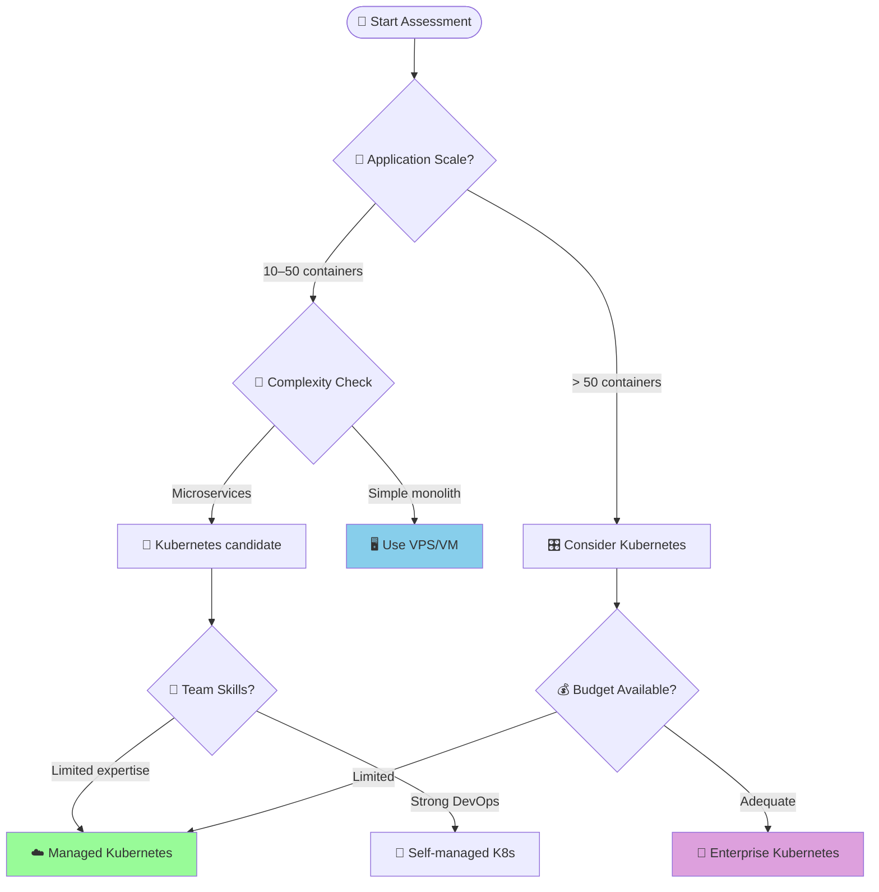

### 🎯 Alternative Solutions

#### **1. Docker Compose for Small Apps**
```yaml
# docker-compose.yml
version: '3.8'
services:
  frontend:
    image: nginx:alpine
    ports:
      - "80:80"
  
  backend:
    image: node:18-alpine
    environment:
      - DATABASE_URL=postgres://db:5432/myapp
  
  database:
    image: postgres:15
    environment:
      - POSTGRES_DB=myapp
```

**Benefits:**
- ✅ **Simple setup** - Single command deployment
- 💰 **Cost-effective** - No orchestration overhead  
- 🔧 **Easy maintenance** - Minimal operational complexity
- 📚 **Low learning curve** - Familiar Docker concepts

#### **2. Cloud VPS Solutions**
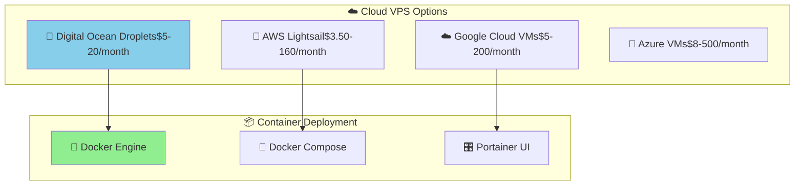

## 📈 Architecture Overview

### 🎛️ Kubernetes vs Traditional Deployment

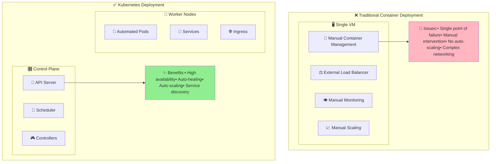

### 🔄 Kubernetes Operational Flow

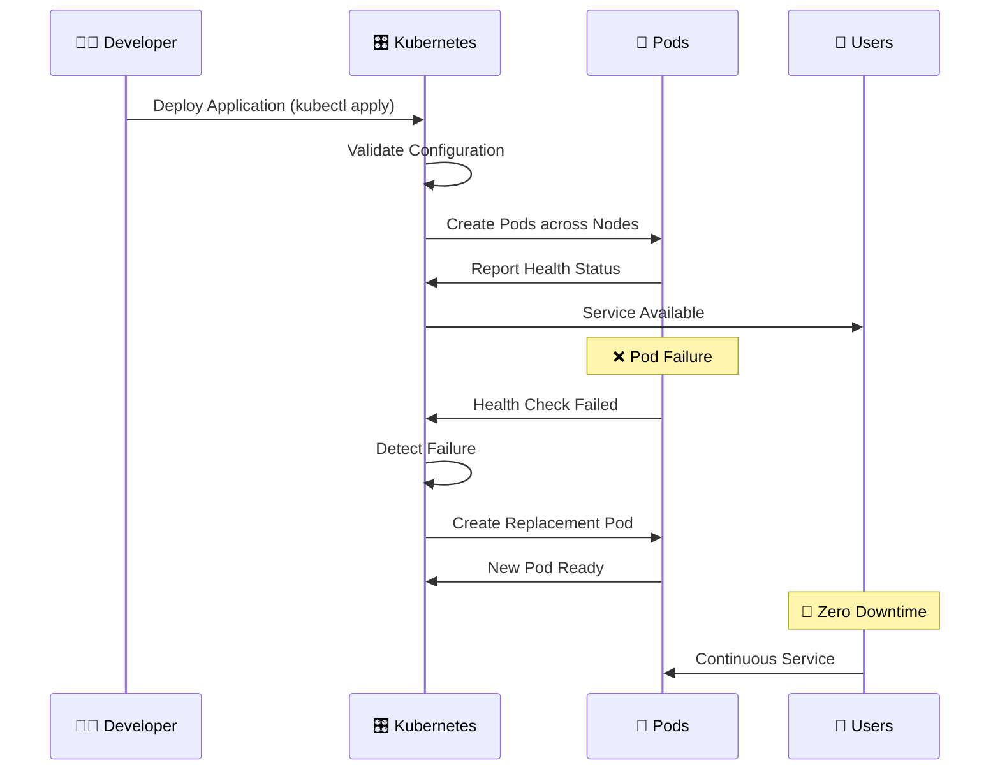

## 🎓 Key Takeaways

### 🔑 When to Choose Kubernetes

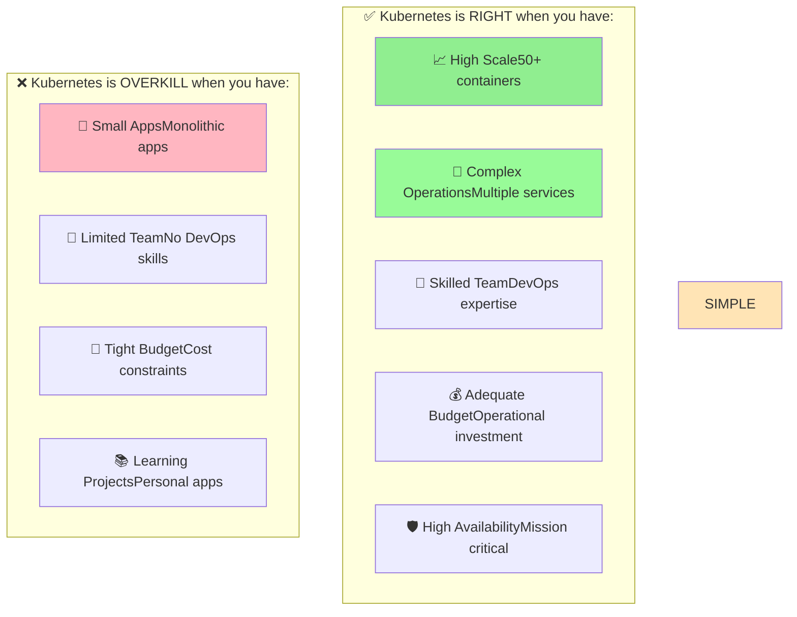

### 🎯 Decision Summary

#### **Choose Kubernetes When:**
- 🏢 **Enterprise-scale applications** with 50+ containers
- 🌍 **Global deployment** requirements
- 👥 **Multiple development teams** working on microservices
- 🚀 **Frequent deployments** and updates needed
- 📈 **Auto-scaling** based on demand required
- 🛡️ **High availability** and fault tolerance critical
- 💼 **Budget available** for operational overhead

#### **Avoid Kubernetes When:**
- 📱 **Small applications** with 2-10 containers
- 🔧 **Simple monolithic** architecture
- 👤 **Limited DevOps expertise** in team
- 💸 **Tight budget** constraints
- 📚 **Learning projects** or personal apps
- ⏰ **Quick deployment** needed without complexity

### 🚀 Next Steps

Based on this video, the learning path continues with:

1. **🏗️ Kubernetes Architecture** - Deep dive into components
2. **🎛️ Control Plane Components** - API Server, etcd, Scheduler
3. **👷 Worker Node Components** - Kubelet, Kube-proxy, Pods
4. **📦 Kubernetes Objects** - Deployments, Services, ConfigMaps
5. **🛠️ kubectl Commands** - Managing Kubernetes resources

### 📝 Assessment Questions

**Before moving to Kubernetes, ask yourself:**

1. **📏 Scale**: Do I have more than 10-20 containers to manage?
2. **🔧 Complexity**: Is my application architecture complex enough to justify orchestration?
3. **👥 Team**: Does my team have Kubernetes expertise or time to learn?
4. **💰 Budget**: Can I afford the additional operational overhead?
5. **🎯 Requirements**: Do I need features like auto-scaling, self-healing, and service discovery?

If you answered **"No"** to most questions, consider simpler alternatives like **Docker Compose** or **cloud VPS solutions**. If you answered **"Yes"** to most questions, **Kubernetes** might be the right choice for your use case! 🚀

**🎯 Remember**: The goal is to solve real problems efficiently, not to use the most advanced technology available. Choose the right tool for your specific needs and context! 💡