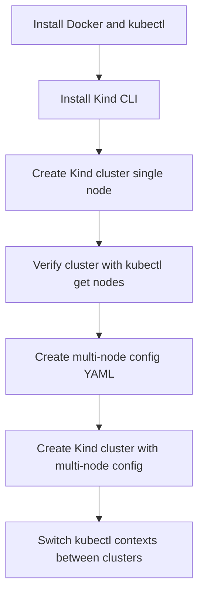

# Complete Notes: Installing & Using Kind Kubernetes Cluster (CKA 2024 Series #6) 🚀🐳

## 🎯 Video Goal  
Learn how to install Kubernetes **locally** using **kind** (Kubernetes IN Docker), setup clusters for Kubernetes CKA hands-on practice, and manage contexts to switch between clusters.

## 1️⃣ Why NOT Use Managed Kubernetes Cloud Providers?  
- Managed services like **AKS, EKS, GKE** abstract away the control plane – no access to troubleshoot/control master nodes → less learning opportunity.  
- For deep understanding and troubleshooting, **local Kubernetes installation** is preferred.  
- Hence, learn Kubernetes using local clusters before using cloud-managed solutions.

## 2️⃣ What is Kind? (Kubernetes IN Docker) 🐳

- Kind runs Kubernetes **clusters in Docker containers** → each container acts like an individual node (either control-plane or worker).  
- Lightweight → easy to setup and destroy clusters quickly for learning and testing.  
- Great for hands-on Kubernetes practice.

## 3️⃣ Prerequisites ✅

- **Go 1.16+** installed (not always mandatory if using pre-built binaries).  
- Docker / Podman / NerdCTL installed (the container runtime).  
- kubectl CLI installed (to interact with your Kubernetes cluster).  

## 4️⃣ Install Kind CLI 🛠️  

### Installation options:  
- **Mac:** `brew install kind`  
- **Windows:** `choco install kind` (chocolatey package manager)  
- **Linux:** Download release binaries or install from source if preferred.

```bash
# Example on Mac
brew install kind
```

## 5️⃣ Creating Your First Cluster with Kind 🚀

```bash
kind create cluster --image kindest/node:v1.29.4 --name cka-cluster1
```

- `--image`: specifies Kubernetes node image version to use (match exam version, here 1.29.4).  
- `--name`: name of the cluster (default is `kind`).  
- This command spins up Docker containers as nodes with the Kubernetes control plane and worker inside same node by default.

## 6️⃣ Verify Cluster Status ⚙️

```bash
kubectl cluster-info --context kind-cka-cluster1
kubectl get nodes
```

- Shows the API server URL and running nodes (single node with control plane and worker roles combined).  
- `kubectl` interacts with Kubernetes clusters via **context**.  
- Make sure `kubectl` CLI is installed. Check version:

```bash
kubectl version --client
```

## 7️⃣ Creating a Multi-Node Cluster with Kind (Control Plane + Workers) 🏗️  

### Create a Kind config YAML file (`config.yml`):

```yaml
kind: Cluster
apiVersion: kind.x-k8s.io/v1alpha4
nodes:
  - role: control-plane
  - role: worker
  - role: worker
```

- 1 control plane node + 2 worker nodes → 3 nodes total.  

### Create cluster with config file:

```bash
kind create cluster --name cka-cluster2 --image kindest/node:v1.29.4 --config config.yml
```

## 8️⃣ Check nodes of new cluster:

```bash
kubectl get nodes
```

- Will show 3 nodes with roles: 1 control-plane + 2 worker nodes.  

## 9️⃣ Managing Multiple Clusters with kubectl Contexts 🔀

- Each cluster has a **context** in kubeconfig.  
- To list contexts:  

```bash
kubectl config get-contexts
```

- `*` shows current context in use.  

- To switch context (i.e. switch cluster you target commands to):

```bash
kubectl config use-context kind-cka-cluster1
kubectl get nodes   # shows nodes from cluster 1
```

Switch back to cluster 2:

```bash
kubectl config use-context kind-cka-cluster2
kubectl get nodes   # shows nodes from cluster 2
```

**Important:** In the CKA exam, make sure to switch to the right context before beginning each task.

## 🔟 Helpful Kubernetes CLI Command Tips  

| Task                       | Command                                   |
|----------------------------|-------------------------------------------|
| List all contexts          | `kubectl config get-contexts`             |
| Switch to a context        | `kubectl config use-context ` |
| Get cluster info           | `kubectl cluster-info`                     |
| List nodes                 | `kubectl get nodes`                        |

## 1️⃣1️⃣ Useful Kubernetes Docs & Cheatsheets 📚

- **Main docs**: [kubernetes.io/docs](https://kubernetes.io/docs/)  
- **Cheat sheet**: Search for "kubectl cheat sheet" on kubernetes.io → essential for exam.  
- **Exam note:** You will have access to official docs during the exam to copy long commands, so no need to memorize everything, but practice enough to be efficient.

## 🔄 Workflow Summary: Installing and Using Kind



## 💡 Key Takeaways:

- **Kind uses Docker containers as nodes** — simple, fast local k8s clusters.  
- Always check & switch kubectl context before running commands.  
- Multi-node cluster simulates real environments better than default single-node cluster.  
- Use Kubernetes official docs and cheat sheets for exam reference.  
- Practice common `kubectl` commands well for exam speed.

## 👀 What's Next?  

- Next video: Creating pods, difference between imperative vs declarative commands, and writing **YAML manifests** (basic Kubernetes resource files).  

🌟 **Happy Learning & Kubernetes Exploration!** 🌟  
Feel free to ask if you want diagrams or more detailed code examples!