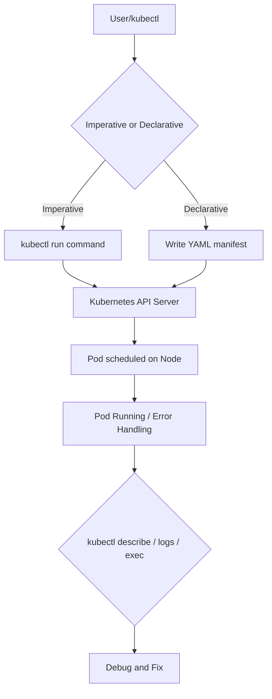

# Complete Notes: Introduction to Pods and YAML in Kubernetes (CKA 2024 Series #7) 🚀

## 🎯 Video Goals
- Understand **Pods** in Kubernetes and their creation methods.
- Grasp **YAML fundamentals** as used in Kubernetes resource configuration.
- Learn the difference between **imperative** and **declarative** approaches to managing resources.
- Get hands-on with creating, troubleshooting, and editing Pods.

## 1️⃣ How Does Kubernetes Work?

**Diagram of Interaction:**
```
User (kubectl) 
      ⬇️
Kubernetes API Server (on Control Plane)
      ⬇️
Cluster Nodes (Worker/Pods)
```
- Users interact with clusters using `kubectl` (client utility).
- All requests (create, update, delete, get) go through the API Server.
- The API server controls Pods and other resources running on nodes.

## 2️⃣ Pod Creation: Imperative vs. Declarative

### 🏁 Imperative Approach (Direct Command)

- **Best for:** Quick tasks, troubleshooting, simple resources.
- **Command Example:**
    ```bash
    kubectl run nginx-pod --image=nginx
    ```
    - Creates a Pod named `nginx-pod` with the `nginx` container.
    - Check Pod status with:
      ```bash
      kubectl get pods
      ```
    🚦 *Pod status "READY 1/1" means the Pod has one container, which is running.*

- **Key Point:** Imperative commands are fast but **not reusable**; not ideal for complex, production, or version-controlled deployments.

### 📜 Declarative Approach (YAML Configuration)

- **Best for:** Production, CI/CD pipelines, GitOps, reuse, complex resources.
- **You define the "desired state" in a YAML file and apply it to the cluster.**
- YAML is the preferred configuration format in Kubernetes (JSON is also supported, but rarely used).

**Example: Minimal Pod YAML**
```yaml
apiVersion: v1
kind: Pod
metadata:
  name: nginx-pod
  labels:
    env: demo
    type: frontend
spec:
  containers:
    - name: nginx-container
      image: nginx
      ports:
        - containerPort: 80
```

- Save the file as `pod.yaml`, then create the Pod:
    ```bash
    kubectl create -f pod.yaml
    # or
    kubectl apply -f pod.yaml
    ```
    `apply` works for both creating and updating resources.

## 3️⃣ YAML Basics & Best Practices 📝

- **Comments:** Start with `#`
    ```
    # This is a YAML comment
    ```
- **Indentation:** Critical! Use **spaces**, not tabs. Typically 2 spaces per level.
- **Data Types:** Supports strings, ints, lists, dictionaries/maps, nested lists.
    ```yaml
    employee:
      name: Alice
      age: 30
      skills:
        - Python
        - Kubernetes
      address:
        old: "123 Old St"
        new: "456 New Ave"
    ```
- **Kubernetes File Structure:**
    - **Always 4 top-level fields:**
        - `apiVersion`
        - `kind`
        - `metadata`
        - `spec`
    - **Order & spelling are case-sensitive** (ex: `kind: Pod`, NOT `kind: pod`).

## 4️⃣ Useful Commands & Troubleshooting 🛠️

- **Delete a Pod**
    ```bash
    kubectl delete pod nginx-pod
    ```

- **Describe a Pod (view events, errors, node info, etc.)**
    ```bash
    kubectl describe pod nginx-pod
    ```

- **Edit a Pod directly (fix errors without editing YAML file)**
    ```bash
    kubectl edit pod nginx-pod
    # Opens pod spec in your default editor
    ```

- **Get extended Pod/node info**
    ```bash
    kubectl get pods -o wide      # Shows node assignment, Pod IP, etc.
    kubectl get nodes -o wide     # Shows kernel, OS, IP, etc.
    ```

- **Show labels on resource**
    ```bash
    kubectl get pods nginx-pod --show-labels
    ```

- **Access Pod Shell**
    ```bash
    kubectl exec -it nginx-pod -- sh
    ```

- **Check Pod logs**
    ```bash
    kubectl logs nginx-pod
    ```

- **Troubleshoot image pull errors**
    - Misspelled or unauthorized images cause `ImagePullBackOff` errors.

## 5️⃣ Generating YAML Automatically (Pro-Tip) 🤖

You don’t have to write YAML from scratch!

```bash
kubectl run nginx --image=nginx --dry-run=client -o yaml > my-nginx-pod.yaml
```
- `--dry-run=client`: Does not create resource
- `-o yaml`: Outputs YAML to the console
- `>`: Redirects output to a file

You can edit this file as needed and apply it:
```bash
kubectl apply -f my-nginx-pod.yaml
```

**Generate JSON if needed:**
```bash
kubectl run nginx --image=nginx --dry-run=client -o json > pod.json
```

## 6️⃣ Assignment & Practice Tasks 💪

1. **Create a Pod imperatively**:  
   `kubectl run nginx-pod --image=nginx`
2. **Generate YAML from imperative command**, modify Pod name, create new Pod with it.
3. **Troubleshoot YAML errors**:  
   - Fix a deliberately misconfigured YAML, re-apply, verify Pod health.

## 7️⃣ Handy Flowchart: Pod Lifecycle in Kubernetes



## 🌟 Key Takeaways

- **Pods** are the smallest deployable object in Kubernetes.
- There are **two main methods** to create/manage resources: *imperative* (one-shot commands) and *declarative* (YAML/JSON manifests).
- **YAML** is essential in Kubernetes. Master its syntax, indentation, and conventions!
- Use `kubectl explain`, `kubectl describe`, and dry-run output for help and self-generation of manifests.
- Use **labels** to organize, search, and group resources.
- Always remember to **troubleshoot** using logs, describe, and edit operations.
- **Practice** with assignments to reinforce learning.
---


# 🚀 Mastering Pods in Kubernetes 🧱 

## ✅ Task 1: Create an Nginx Pod Imperatively

💡 **Imperative commands** are used when you want to quickly spin up a pod without writing a YAML file.

```bash
kubectl run nginx --image=nginx
```

📝 This command tells Kubernetes to:

* Create a pod named `nginx`
* Use the Docker image `nginx`

🔍 Verify the pod:

```bash
kubectl get pods
```

---

## ✅ Task 2: Generate YAML from Pod & Reuse It

### 🧾 Step 1: Export YAML from existing pod

```bash
kubectl get pod nginx -o yaml > nginx-pod.yaml
```

### ✍️ Step 2: Edit the YAML

Change the pod name from `nginx` → `nginx-new` in the `metadata.name` field.

```yaml
metadata:
  name: nginx-new
```

Also, **remove** the following fields to avoid issues:

* `status:`
* `creationTimestamp:`
* `resourceVersion:`
* `uid:`
* `selfLink:`

### 🧪 Step 3: Create new pod using YAML

```bash
kubectl apply -f nginx-pod.yaml
```

🔍 Verify:

```bash
kubectl get pods
```

You should now see:

```bash
nginx         Running
nginx-new     Running
```

---

## 🚨 Task 3: Apply Broken YAML & Fix Errors

### 🧾 Faulty YAML:

```yaml
apiVersion: v1
kind: Pod
metadata:
  labels:
    app: test
  name: redis
spec:
  containers:
  - image: rediss
    name: redis
```

### ⚠️ Apply it:

```bash
kubectl apply -f redis.yaml
```

### ❌ Error:

```
Failed to pull image "rediss": rpc error: code = Unknown desc = Error response from daemon: pull access denied for rediss
```

### 🧠 Root Cause:

`rediss` is a **typo** – correct image name is `redis`.

### 🛠️ Fix:

Edit the YAML:

```yaml
- image: redis
```

Then apply again:

```bash
kubectl apply -f redis.yaml
```

🎉 The pod should now be in **Running** state.

---

## 📘 Key Learnings

| 🔍 Concept                    | 🧠 Takeaway                                                 |
| ----------------------------- | ----------------------------------------------------------- |
| **Imperative vs Declarative** | Quick testing vs. long-term reusable config                 |
| **Exporting YAML**            | Use `kubectl get -o yaml` to create templates               |
| **Editing YAML**              | Always remove metadata like `uid`, `resourceVersion`, etc.  |
| **Troubleshooting**           | Read error logs carefully, usually a typo or invalid config |
| **Pod Debugging**             | Use `kubectl describe pod <name>` for deep insights         |

---

## 📚 References

* 📘 [Kubernetes Official Docs – Pods](https://kubernetes.io/docs/concepts/workloads/pods/)
* 🧪 `kubectl` CLI Reference: [https://kubernetes.io/docs/reference/kubectl/](https://kubernetes.io/docs/reference/kubectl/)
* 📦 Docker Hub: [https://hub.docker.com/\_/nginx](https://hub.docker.com/_/nginx)
* 📦 Redis Docker Image: [https://hub.docker.com/\_/redis](https://hub.docker.com/_/redis)

---