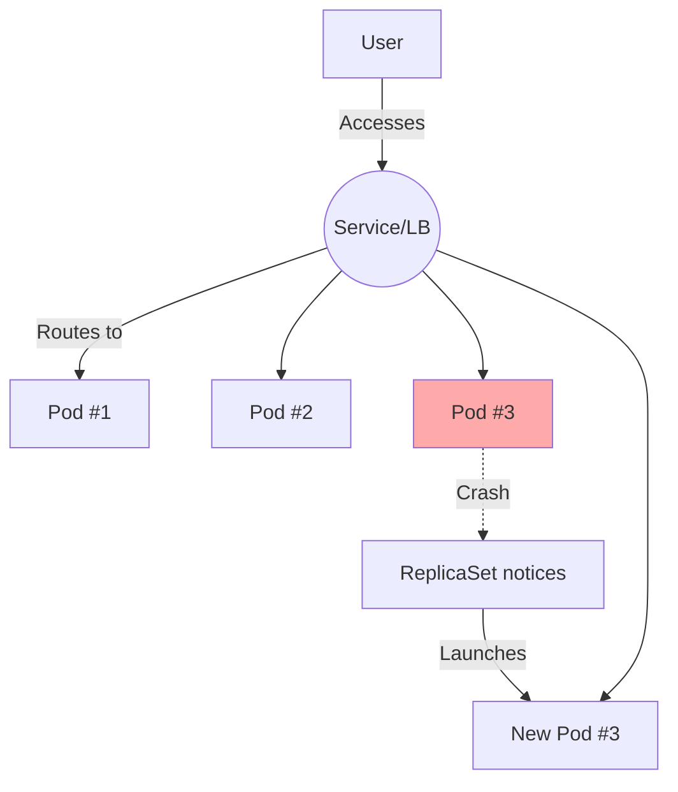
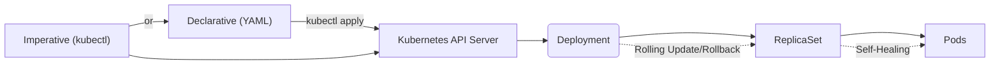
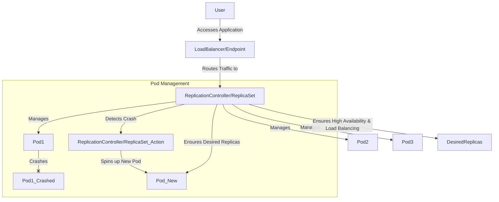
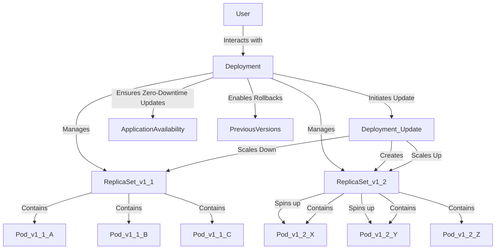

# ✨ Complete Notes: Deployments & ReplicaSets in Kubernetes (CKA 2024 Video 8) ✨

## 🎯 **Video Goals**

- Deep dive into **Replication Controllers**, **ReplicaSets**, and **Deployments** in Kubernetes.
- Understand their use, differences, and underlying mechanics.
- Learn and practice all ways to scale, update, and manage applications for high availability and zero downtime.
- Get hands-on with YAML, imperative commands, and best troubleshooting techniques.

## 1️⃣ **What Problems Do Replication Controllers & Deployments Solve?**

Imagine you run a Pod (say, an `nginx` webserver) on your cluster:

- User accesses the Pod via a (yet-to-be-covered) service/load balancer.
- **Problem:** If the Pod crashes or the Node dies, the app becomes unavailable!  
- **Solution:** **Kubernetes controllers** can:
    - Automatically maintain a desired number of Pods (self-healing!)
    - Reschedule crashed Pods.
    - Let you scale up/down replicas for increased traffic or resilience.
    - Enable **rolling updates** with zero downtime (via Deployments).

## 2️⃣ **Controller Hierarchy & Flow Diagrams**

### 📦 Resource Hierarchy

```
Deployment
   └─ ReplicaSet
          └─ Pods
```
- **User** 🧑💻 creates **Deployment** → Deployment manages ReplicaSets → ReplicaSet manages Pods.

### 🌐 Pod Availability & Auto-Healing



## 3️⃣ **Replication Controller (Legacy)**

Replicates Pods for high availability.

### **YAML Example**

```yaml
apiVersion: v1                   # Version for RC
kind: ReplicationController      # Kind
metadata:
  name: nginx-pyon-rc
  labels:
    env: demo
spec:
  replicas: 3
  template:
    metadata:
      labels:
        env: demo
        type: frontend
    spec:
      containers:
      - name: nginx-container
        image: nginx
        ports:
        - containerPort: 80
```

- **Key:** `replicas` ensures desired Pod count.
- **Controller*:** Watches for failed Pods and creates replacements instantly.

#### **Create RC, Check status, Demo Healing**

```bash
kubectl apply -f rc.yaml        # Create RC and its Pods
kubectl get pods                # See all 3 Pods
kubectl delete pod    # Delete a pod - RC will auto-create a replacement!
kubectl get rc                  # See RC status (desired/ready Pods)
```

### 🤔 **RC vs. ReplicaSet: What’s the Difference?**

- **Replication Controller:**
    - Legacy, simple.
    - Only manages Pods it creates via “template”.
- **ReplicaSet (RS):**
    - Modern, preferred.
    - Supports **label selectors**, can "adopt" matching existing Pods.
    - Used *internally* by Deployments.

## 4️⃣ **ReplicaSet: Modern, Flexible Controller**

### **YAML Example with Label Selectors**

```yaml
apiVersion: apps/v1                # "apps" group is mandatory for RS
kind: ReplicaSet
metadata:
  name: nginx-rs
  labels:
    env: demo
spec:
  replicas: 3
  selector:                   # Mandatory for RS!
    matchLabels:
      env: demo
  template:                   # Pod template
    metadata:
      labels:
        env: demo
        type: frontend
    spec:
      containers:
      - name: nginx-container
        image: nginx
        ports:
        - containerPort: 80
```

#### **Create ReplicaSet, Check/Scale/Update**

```bash
kubectl apply -f rs.yaml
kubectl get pods                  # Now managed via RS
kubectl get rs
```

#### **Scale Replicas (multiple ways):**
```bash
# Edit the YAML ("replicas: N"), then re-apply
kubectl apply -f rs.yaml

# Edit live object (handy in exam)
kubectl edit rs nginx-rs

# Imperatively:
kubectl scale rs nginx-rs --replicas=5
```

#### **Delete the ReplicaSet**

```bash
kubectl delete rs nginx-rs
kubectl get pods     # All managed Pods are gone
```

## 5️⃣ **Deployment: THE Gold Standard for Production 🚀**

- Sits above ReplicaSet in the hierarchy.
- Adds important features:
    - **Rolling Updates**: update Pods one-by-one or in batches, **no downtime**.
    - **Rollbacks**: revert to previous versions on failure.
    - **Declarative/imperative control**.

### **Deployment YAML Example**

```yaml
apiVersion: apps/v1
kind: Deployment
metadata:
  name: nginx-deploy
spec:
  replicas: 3
  selector:
    matchLabels:
      app: nginx
  template:
    metadata:
      labels:
        app: nginx
    spec:
      containers:
        - name: nginx
          image: nginx:latest
          ports:
            - containerPort: 80
```

#### **Create and Inspect Deployment**

```bash
kubectl apply -f deployment.yaml
kubectl get all        # Shows deploy, RS, Pods, Service info
kubectl get deploy     # Summary
kubectl describe deploy nginx-deploy
```

### 🚦 **Rolling Updates & Zero Downtime**

#### Update the image (Rolling fashion)

```bash
kubectl set image deploy nginx-deploy nginx=nginx:1.19.1
kubectl rollout status deploy nginx-deploy     # View progress
kubectl get pods                              # Watch new Pods appear as old ones terminate
```

- **Rolling Update:** At any time, some Pods serve the user while others update, so users never experience downtime.
- **Rollback instantly if release fails:**
    ```bash
    kubectl rollout undo deploy nginx-deploy
    ```

#### Rollout History

```bash
kubectl rollout history deploy nginx-deploy
```

### 🧠 **Deployment Cheat-Sheet**

| Operation                   | Command                                             |
|-----------------------------|----------------------------------------------------|
| Create deployment           | `kubectl apply -f deployment.yaml`                 |
| View all resources          | `kubectl get all`                                  |
| Scale replicas              | `kubectl scale deployment nginx-deploy --replicas=N`|
| Update image                | `kubectl set image deploy nginx-deploy nginx=nginx:1.19.1` |
| Monitor rollout             | `kubectl rollout status deploy nginx-deploy`       |
| Rollback deployment         | `kubectl rollout undo deploy nginx-deploy`         |
| View rollout history        | `kubectl rollout history deploy nginx-deploy`      |

## 6️⃣ **Imperative: Generate YAML/Resource with Dry-Run** 🚀

```bash
kubectl create deploy nginx-new --image=nginx --dry-run=client -o yaml > deploy.yaml
```
- Now edit `deploy.yaml` before applying!

## 7️⃣ **Summary Mindmap / Flow Diagram**



## 8️⃣ **Key Concepts Recap**

- **Replication Controller (RC):** Legacy, auto-heals, less flexible.
- **ReplicaSet (RS):** Modern RC, label selector, used by Deployments.
- **Deployment:** Production standard, manages RS, enables rolling updates/rollbacks.
- **Scaling:** Scale up/down via YAML changes, imperative commands, or `edit`ing live objects.
- **Rolling Updates:** No downtime, safe, and can be rolled back.
- **Imperative & Declarative:** Both are valid—pick which saves time and suits your workflow.

## 9️⃣ **Hands-On Assignments to Reinforce**

1. **Create a ReplicaSet with 2 Nginx Pods. Scale to 5, then back to 1.**
2. **Update your Deployment’s image using `kubectl set image`, check `rollout status`, then rollback.**
3. **Create a Deployment using kubectl with `--dry-run=client -o yaml`, edit and apply.**
4. **Practice deleting, editing, and describing resources, troubleshooting events and errors.**

## 🏆 **Pro Tips for CKA Exam**

- Practice all **3 scaling techniques**: YAML, imperative, live-edit.
- **Cheat-sheet access is allowed**! Use it for syntax/commands in exam (time is precious).
- Use `kubectl help` and `kubectl explain` freely.
- Get comfortable with **labels/selectors** for resource targeting.
- Understand difference between **Pod**, **ReplicaSet**, and **Deployment**.


---
# ✨ Complete Notes: Deployments & ReplicaSets in Kubernetes (CKA 2024 Video 8) ✨

## 🎯 **Video Goals**

- Deep dive into **Replication Controllers**, **ReplicaSets**, and **Deployments** in Kubernetes.
- Understand their use, differences, and underlying mechanics.
- Learn and practice all ways to scale, update, and manage applications for high availability and zero downtime.
- Get hands-on with YAML, imperative commands, and best troubleshooting techniques.

## 1️⃣ **What Problems Do Replication Controllers & Deployments Solve?**

Imagine you run a Pod (say, an `nginx` webserver) on your cluster:

- User accesses the Pod via a (yet-to-be-covered) service/load balancer.
- **Problem:** If the Pod crashes or the Node dies, the app becomes unavailable!  
- **Solution:** **Kubernetes controllers** can:
    - Automatically maintain a desired number of Pods (self-healing!)
    - Reschedule crashed Pods.
    - Let you scale up/down replicas for increased traffic or resilience.
    - Enable **rolling updates** with zero downtime (via Deployments).

## 2️⃣ **Controller Hierarchy & Flow Diagrams**

### 📦 Resource Hierarchy

```
Deployment
   └─ ReplicaSet
          └─ Pods
```
- **User** 🧑💻 creates **Deployment** → Deployment manages ReplicaSets → ReplicaSet manages Pods.

### 🌐 Pod Availability & Auto-Healing


## 3️⃣ **Replication Controller (Legacy)**

Replicates Pods for high availability.

### **YAML Example**

```yaml
apiVersion: v1                   # Version for RC
kind: ReplicationController      # Kind
metadata:
  name: nginx-pyon-rc
  labels:
    env: demo
spec:
  replicas: 3
  template:
    metadata:
      labels:
        env: demo
        type: frontend
    spec:
      containers:
      - name: nginx-container
        image: nginx
        ports:
        - containerPort: 80
```

- **Key:** `replicas` ensures desired Pod count.
- **Controller*:** Watches for failed Pods and creates replacements instantly.

#### **Create RC, Check status, Demo Healing**

```bash
kubectl apply -f rc.yaml        # Create RC and its Pods
kubectl get pods                # See all 3 Pods
kubectl delete pod    # Delete a pod - RC will auto-create a replacement!
kubectl get rc                  # See RC status (desired/ready Pods)
```

### 🤔 **RC vs. ReplicaSet: What’s the Difference?**

- **Replication Controller:**
    - Legacy, simple.
    - Only manages Pods it creates via “template”.
- **ReplicaSet (RS):**
    - Modern, preferred.
    - Supports **label selectors**, can "adopt" matching existing Pods.
    - Used *internally* by Deployments.

## 4️⃣ **ReplicaSet: Modern, Flexible Controller**

### **YAML Example with Label Selectors**

```yaml
apiVersion: apps/v1                # "apps" group is mandatory for RS
kind: ReplicaSet
metadata:
  name: nginx-rs
  labels:
    env: demo
spec:
  replicas: 3
  selector:                   # Mandatory for RS!
    matchLabels:
      env: demo
  template:                   # Pod template
    metadata:
      labels:
        env: demo
        type: frontend
    spec:
      containers:
      - name: nginx-container
        image: nginx
        ports:
        - containerPort: 80
```

#### **Create ReplicaSet, Check/Scale/Update**

```bash
kubectl apply -f rs.yaml
kubectl get pods                  # Now managed via RS
kubectl get rs
```

#### **Scale Replicas (multiple ways):**
```bash
# Edit the YAML ("replicas: N"), then re-apply
kubectl apply -f rs.yaml

# Edit live object (handy in exam)
kubectl edit rs nginx-rs

# Imperatively:
kubectl scale rs nginx-rs --replicas=5
```

#### **Delete the ReplicaSet**

```bash
kubectl delete rs nginx-rs
kubectl get pods     # All managed Pods are gone
```

## 5️⃣ **Deployment: THE Gold Standard for Production 🚀**

- Sits above ReplicaSet in the hierarchy.
- Adds important features:
    - **Rolling Updates**: update Pods one-by-one or in batches, **no downtime**.
    - **Rollbacks**: revert to previous versions on failure.
    - **Declarative/imperative control**.

### **Deployment YAML Example**

```yaml
apiVersion: apps/v1
kind: Deployment
metadata:
  name: nginx-deploy
spec:
  replicas: 3
  selector:
    matchLabels:
      app: nginx
  template:
    metadata:
      labels:
        app: nginx
    spec:
      containers:
        - name: nginx
          image: nginx:latest
          ports:
            - containerPort: 80
```

#### **Create and Inspect Deployment**

```bash
kubectl apply -f deployment.yaml
kubectl get all        # Shows deploy, RS, Pods, Service info
kubectl get deploy     # Summary
kubectl describe deploy nginx-deploy
```

### 🚦 **Rolling Updates & Zero Downtime**

#### Update the image (Rolling fashion)

```bash
kubectl set image deploy nginx-deploy nginx=nginx:1.19.1
kubectl rollout status deploy nginx-deploy     # View progress
kubectl get pods                              # Watch new Pods appear as old ones terminate
```

- **Rolling Update:** At any time, some Pods serve the user while others update, so users never experience downtime.
- **Rollback instantly if release fails:**
    ```bash
    kubectl rollout undo deploy nginx-deploy
    ```

#### Rollout History

```bash
kubectl rollout history deploy nginx-deploy
```

### 🧠 **Deployment Cheat-Sheet**

| Operation                   | Command                                             |
|-----------------------------|----------------------------------------------------|
| Create deployment           | `kubectl apply -f deployment.yaml`                 |
| View all resources          | `kubectl get all`                                  |
| Scale replicas              | `kubectl scale deployment nginx-deploy --replicas=N`|
| Update image                | `kubectl set image deploy nginx-deploy nginx=nginx:1.19.1` |
| Monitor rollout             | `kubectl rollout status deploy nginx-deploy`       |
| Rollback deployment         | `kubectl rollout undo deploy nginx-deploy`         |
| View rollout history        | `kubectl rollout history deploy nginx-deploy`      |

## 6️⃣ **Imperative: Generate YAML/Resource with Dry-Run** 🚀

```bash
kubectl create deploy nginx-new --image=nginx --dry-run=client -o yaml > deploy.yaml
```
- Now edit `deploy.yaml` before applying!

## 7️⃣ **Summary Mindmap / Flow Diagram**


## 8️⃣ **Key Concepts Recap**

- **Replication Controller (RC):** Legacy, auto-heals, less flexible.
- **ReplicaSet (RS):** Modern RC, label selector, used by Deployments.
- **Deployment:** Production standard, manages RS, enables rolling updates/rollbacks.
- **Scaling:** Scale up/down via YAML changes, imperative commands, or `edit`ing live objects.
- **Rolling Updates:** No downtime, safe, and can be rolled back.
- **Imperative & Declarative:** Both are valid—pick which saves time and suits your workflow.

## 9️⃣ **Hands-On Assignments to Reinforce**

1. **Create a ReplicaSet with 2 Nginx Pods. Scale to 5, then back to 1.**
2. **Update your Deployment’s image using `kubectl set image`, check `rollout status`, then rollback.**
3. **Create a Deployment using kubectl with `--dry-run=client -o yaml`, edit and apply.**
4. **Practice deleting, editing, and describing resources, troubleshooting events and errors.**

## 🏆 **Pro Tips for CKA Exam**

- Practice all **3 scaling techniques**: YAML, imperative, live-edit.
- **Cheat-sheet access is allowed**! Use it for syntax/commands in exam (time is precious).
- Use `kubectl help` and `kubectl explain` freely.
- Get comfortable with **labels/selectors** for resource targeting.
- Understand difference between **Pod**, **ReplicaSet**, and **Deployment**.

---

## 🚀 Key Concepts: Pods, Replica Sets, and Deployments

At its core, Kubernetes aims to manage containerized applications. A single **Pod** 📦 is the smallest deployable unit in Kubernetes, representing a single instance of your application. However, running standalone Pods has a significant drawback: if a Pod crashes, your application becomes unavailable. This is where **Replica Sets** and **Deployments** come into play.

### 🌐 The Problem: Pod Crashes and Downtime

Imagine a user accessing an Nginx Pod. If this Pod crashes, the user receives no response, leading to **downtime**. This is unacceptable for production applications.

-----

### 🛡️ The Solution: Replication Controller & Replica Set

To address Pod failures and ensure high availability, Kubernetes introduces the concept of **Replication Controllers** (legacy) and **Replica Sets** (preferred and newer).

A **Replication Controller** or **Replica Set** is a Kubernetes object that ensures a specified number of Pod replicas are running at all times.

#### **Flow Diagram: How a Replication Controller/Replica Set Works**



#### **Key Responsibilities:**

  * **Auto-Healing:** If a Pod crashes or gets deleted, the Replica Set automatically spins up a new Pod to maintain the desired number of replicas.
  * **High Availability:** By running multiple identical instances of a Pod, the application remains available even if some Pods fail.
  * **Load Balancing:** The Replica Set redirects traffic to healthy Pods. While it doesn't perform explicit load balancing itself, it works in conjunction with Services (discussed in later videos) to distribute traffic across its managed Pods.
  * **Scaling:** You can manually scale your application by increasing or decreasing the `replicas` count in the Replica Set definition. This allows you to handle increased user traffic or scale down during low demand.

#### **Replication Controller vs. Replica Set:**

  * **Replication Controller (RC):**
      * **Legacy** version.
      * Manages only Pods that *it* created.
  * **Replica Set (RS):**
      * **Newer and preferred** version.
      * Can manage **existing Pods** that were not initially part of the Replica Set, using **`selector.matchLabels`**. This is a key differentiator.

#### **Replica Set Manifest Example (`rc.yaml` for ReplicaSet):**

```yaml
apiVersion: apps/v1 # Note the 'apps/v1' for ReplicaSet
kind: ReplicaSet
metadata:
  name: nginx-rs # Changed from RC to RS
  labels:
    env: demo
spec:
  replicas: 3 # Desired number of Pod replicas
  selector: # This is crucial for ReplicaSet to manage existing pods
    matchLabels:
      env: demo # Matches pods with this label
  template: # Pod template definition
    metadata:
      labels:
        app: nginx # Pod specific label
        env: demo # Pod specific label, matching the selector
    spec:
      containers:
      - name: nginx
        image: nginx:latest
        ports:
        - containerPort: 80
```

-----

### 🚀 Deployments: Beyond Replica Sets for Seamless Updates

While Replica Sets handle basic replication and auto-healing, **Deployments** offer additional, crucial functionalities, especially for managing application updates and rollbacks.

A **Deployment** is a higher-level Kubernetes object that manages Replica Sets and provides declarative updates to Pods and Replica Sets.

#### **Flow Diagram: How Deployment Works**



#### **Key Advantages of Deployments:**

  * **Rolling Updates:** This is the primary benefit. When you update a Deployment (e.g., change the image version), it performs a rolling update. This means new Pods with the updated version are gradually brought up while old Pods are gracefully terminated. This ensures **zero-downtime deployments**, critical for production environments.
  * **Rollbacks:** Deployments maintain a history of revisions, allowing you to easily roll back to a previous stable version if an update causes issues.
  * **Declarative Updates:** You define the desired state, and the Deployment controller works to achieve and maintain that state.
  * **Management of Replica Sets:** A Deployment implicitly creates and manages Replica Sets. When you perform an update, the Deployment creates a *new* Replica Set for the new version and scales down the old one.

#### **Deployment Manifest Example (`deploy.yaml`):**

```yaml
apiVersion: apps/v1 # Same API version as ReplicaSet for Deployment
kind: Deployment
metadata:
  name: nginx-deploy
  labels:
    env: demo
spec:
  replicas: 3
  selector:
    matchLabels:
      app: nginx
  template:
    metadata:
      labels:
        app: nginx
    spec:
      containers:
      - name: nginx
        image: nginx:latest # Image to be deployed
        ports:
        - containerPort: 80
```

-----

### 💻 Hands-On: Working with Deployments and Replica Sets

#### **Creating a Replica Set:**

1.  **Define the YAML:** Create an `rc.yaml` file (or `rs.yaml`) as shown above, ensuring `kind: ReplicaSet` and `apiVersion: apps/v1`.
2.  **Apply the YAML:**
    ```bash
    kubectl apply -f rc.yaml
    ```
3.  **Verify Pods and Replica Set:**
    ```bash
    kubectl get pods
    kubectl get rs
    ```

#### **Scaling a Replica Set:**

  * **Via YAML:** Update the `replicas` field in `rc.yaml` and re-apply:
    ```bash
    kubectl apply -f rc.yaml
    ```
  * **Editing Live Object:**
    ```bash
    kubectl edit rs nginx-rs
    ```
    (Change `replicas` and save. Changes are applied immediately.)
  * **Imperative Command (Recommended for Speed in Exams):**
    ```bash
    kubectl scale --replicas=10 rs/nginx-rs
    ```

#### **Creating a Deployment:**

1.  **Define the YAML:** Create a `deploy.yaml` file as shown above, ensuring `kind: Deployment` and `apiVersion: apps/v1`.
2.  **Apply the YAML:**
    ```bash
    kubectl apply -f deploy.yaml
    ```
3.  **Verify Deployment, Replica Set, and Pods:**
    ```bash
    kubectl get deploy
    kubectl get rs
    kubectl get pods
    kubectl get all # Shows all related resources
    ```

#### **Updating a Deployment (Rolling Update):**

  * **Imperative Command (Recommended):**
    ```bash
    kubectl set image deployment/nginx-deploy nginx=nginx:1.9.1
    ```
    This command updates the `nginx` container's image to `nginx:1.9.1` within the `nginx-deploy` deployment. Observe the Pods as they are updated in a rolling fashion.

#### **Checking Deployment History:**

  * To see the different revisions of your deployment:
    ```bash
    kubectl rollout history deployment/nginx-deploy
    ```

#### **Rolling Back a Deployment:**

  * To undo the last deployment change:
    ```bash
    kubectl rollout undo deployment/nginx-deploy
    ```
    You can also roll back to a specific revision using `--to-revision=<revision-number>`.

#### **Generating YAML from Imperative Commands (Dry Run):**

  * This is a useful technique to quickly generate a base YAML for a resource.
    ```bash
    kubectl create deployment nginx-new --image=nginx --dry-run=client -o yaml > deploy_new.yaml
    ```
    This command creates a deployment named `nginx-new` with the `nginx` image, performs a dry run (doesn't actually create it), outputs the YAML to the console, and redirects it to a file named `deploy_new.yaml`.

-----

## ✅ Summary

  * **Pods** are the basic unit, but lack self-healing.
  * **Replica Sets** ensure a desired number of Pod replicas are running, providing auto-healing and high availability.
  * **Deployments** manage Replica Sets and enable **zero-downtime rolling updates** and **easy rollbacks**, making them the go-to choice for managing applications in Kubernetes.

By understanding these concepts and practicing the associated commands, you'll be well-equipped to manage your applications effectively in a Kubernetes environment.

-----
